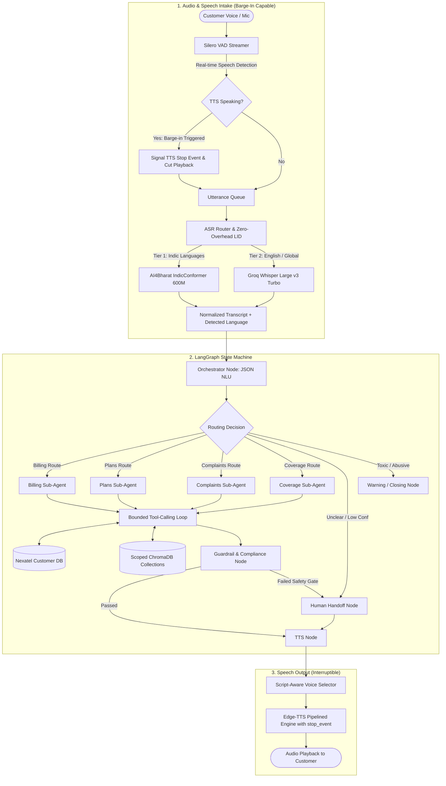

# VAY: Multilingual GenAI Voice Assistant for Customer Care

[](https://www.python.org/downloads/release/python-3110/)
[](https://github.com/astral-sh/uv)
[](https://github.com/langchain-ai/langgraph)
[](https://www.trychroma.com/)

VAY is an enterprise-grade, multilingual GenAI voice assistant tailored for telecommunications customer care. It enables automated self-service (billing queries, plan upgrades, technical troubleshooting, complaint management, and network coverage checks) across Indian languages (Tamil, Hindi, Telugu, Kannada, Malayalam, etc.) and global languages with low latency, real-time barge-in (interruption handling), strict regulatory compliance, and graceful human agent escalation.

---

## Architecture Overview



---

## Technical Highlights

- **Dual-Tier ASR Engine**: Uses `ai4bharat/indic-conformer-600m-multilingual` for Indian languages (achieving **26.06% WER in Tamil** vs. Whisper's 62.44%, and **12.00% in Hindi**) and `openai/whisper-large-v3-turbo` for English (**3.79% WER**) and global fallback.
- **Real-Time Barge-In (Interruption Handling)**: Seamlessly detects customer speech while the assistant is speaking, instantly cuts TTS playback via `stop_event` polling, and routes the new utterance to the pipeline without audio collisions.
- **Zero-Overhead Language Identification**: Single-pass Whisper auto-transcription extracts language and text in one round-trip, eliminating redundant LID latency.
- **Domain-Scoped Hybrid RAG**: Fuses BM25 term frequency with dense vector cosine distance across 5 isolated ChromaDB collections (`billing_policy`, `product_catalog`, `support_faq`, `technical_kb`, `compliance_policy`).
- **Code-Enforced Two-Phase Consent**: Critical actions (`changePlan`, `sendPaymentLink`) stage operations and enforce regex confirmation on customer speech (`AFFIRMATION_PATTERN`), bypassing LLM discretion.
- **Pipelined TTS Synthesis**: Sentence-level chunking and asynchronous background pre-buffering reduce speech time-to-first-audio by ~40% (down to ~1.08s).
- **Session-Bound Identity Isolation**: Account parameters are closed over by domain tools and cannot be altered or injected by the LLM.

---

## Documentation Index

Explore deep-dive technical documentation for each subsystem:

1. [Speech-to-Text & ASR Pipeline](docs/asr_stt_pipeline.md): Voice Activity Detection (VAD), real-time barge-in interruption detection, Whisper single-pass LID, IndicConformer CTC execution, and transcript normalization.
2. [LangGraph Agentic Architecture & Orchestration](docs/agent_graph.md): State schema, Orchestrator NLU node, 4 domain sub-agents, bounded tool loop, near-duplicate query guards, and routing rules.
3. [Knowledge Retrieval & Scoped Hybrid RAG](docs/rag_system.md): 5 ChromaDB collections, BM25 + dense vector score fusion, semantic chunking with heading propagation, and confidence scoring.
4. [Compliance, Guardrails & Human Handoff](docs/guardrails_and_handoff.md): Two-phase consent gates, PII leak filters, abusive caller multi-strike policy, session isolation, and `handoff_log.jsonl` queue.
5. [Text-to-Speech (TTS) Pipeline](docs/tts_pipeline.md): Microsoft Edge neural voice matrix (18 languages), script-aware Unicode routing, sentence-level streaming pipelining, and non-blocking interruptible playback (`stop_event`).
6. [Customer Database & Tool Backend](docs/database_and_tools.md): Relational SQLite schema (`customers`, `plans`, `subscriptions`, `bills`, `tickets`, `coverage`), domain tool catalogs, and seed accounts.
7. [Evaluation, Benchmarks & Quality Audit](docs/evaluation_and_benchmarks.md): Mozilla Common Voice WER comparative benchmarks, end-to-end latency breakdowns, RAG retrieval accuracy deltas, and bug audit resolution history.

---

## Quick Start

### 1. Prerequisites
- Python 3.11
- [uv](https://astral.sh/uv) package manager
- Groq API Key (for LLM and Whisper inference)

#### Install `uv`:
```bash
# Linux / macOS
curl -LsSf https://astral.sh/uv/install.sh | sh

# Windows PowerShell
powershell -ExecutionPolicy ByPass -c "irm https://astral.sh/uv/install.ps1 | iex"
```

---

### 2. Installation & Environment Setup

```bash
# 1. Clone repository
git clone https://github.com/vishvaa-vsk/VAY-multilingual-agent.git
cd VAY-multilingual-agent

# 2. Sync dependencies and create virtual environment
uv sync

# 3. Create .env file with your Groq credentials
cp .env.example .env
# Edit .env and set:
# GROQ_API_KEY="gsk_..."
# GROQ_MODEL="openai/gpt-oss-20b"
```

---

### 3. One-Step Automated Setup & Launch (Recommended)

The project includes an automated master setup script (`scripts/setup_app.py`) that executes the entire initialization sequence:
1. Seeds the SQLite customer database (`src/vay/tools/nexatel_customers.db`).
2. Builds and indexes the ChromaDB knowledge bases from `data/kb/*.md`.
3. Pre-caches the HuggingFace ASR models (`ai4bharat/indic-conformer-600m-multilingual`).
4. Launches the full Streamlit web interface with WebGL audio visualizers.

```bash
uv run python scripts/setup_app.py
```

---

### 4. Running Specific Operational Modes

#### A. Real-Time Voice Assistant (Microphone + Speaker + Barge-in)
```bash
# Interactive mode (prompts for phone number and starts voice loop)
uv run python scripts/run_voice.py

# Specify demo account directly with barge-in enabled
uv run python scripts/run_voice.py --phone 9876543210 --language ta --barge_in --show_debug
```

#### B. Text Console Interface (No Microphone Required)
```bash
uv run python scripts/run_assistant.py --phone 9876543210 --language en
```

#### C. Dedicated DB & KB Admin Operations
```bash
# Re-seed SQLite DB
uv run python scripts/manage_db.py --seed

# Rebuild ChromaDB KB
uv run python scripts/build_kb.py --reset
```

---

## Testing & Code Quality

```bash
# Run unit tests
uv run pytest tests/ -v

# Run linting checks
uv run ruff check src tests

# Run type checker
uv run mypy src
```

---

## Project Structure

```
VAY-multilingual-agent/
├── README.md                      # Primary project overview and documentation index
├── pyproject.toml                 # uv project configuration and dependencies
├── app.py                         # WebGL and Streamlit demonstration application
├── handoff_log.jsonl              # Human escalation context log (runtime generated)
│
├── docs/                          # Detailed technical documentation
│   ├── asr_stt_pipeline.md        # Speech-to-Text, VAD, ASR router, and Barge-In
│   ├── agent_graph.md             # LangGraph state machine and sub-agents
│   ├── rag_system.md              # Hybrid BM25 + Vector RAG engine
│   ├── guardrails_and_handoff.md  # Consent verification and safety guardrails
│   ├── tts_pipeline.md            # Text-to-Speech synthesis and pipelining
│   ├── database_and_tools.md      # SQLite schema, seed data, and tool definitions
│   └── evaluation_and_benchmarks.md # WER benchmarks and latency evaluations
│
├── data/
│   └── kb/                        # Raw policy and product knowledge base documents
│       ├── billing_policy.md
│       ├── product_catalog.md
│       ├── support_faq.md
│       ├── technical_kb.md
│       └── compliance_policy.md
│
├── scripts/                       # CLI operational and setup scripts
│   ├── setup_app.py               # All-in-one setup (DB + KB + ASR Cache + Streamlit)
│   ├── run_voice.py               # Real-time microphone voice loop (with Barge-In)
│   ├── run_assistant.py           # Text REPL interaction entry point
│   ├── build_kb.py                # ChromaDB knowledge base ingestion
│   ├── manage_db.py               # SQLite customer database admin
│   └── manage_kb.py               # ChromaDB collection admin
│
├── src/vay/                       # Core application package
│   ├── config.py                  # Global settings and environment variables
│   ├── types.py                   # Pydantic data models and schemas
│   ├── asr/                       # IndicConformer, Whisper, and ASR routing
│   ├── audio/                     # Silero VAD, STTPipeline, and Barge-in handlers
│   ├── graph/                     # LangGraph nodes, routing, and workflows
│   ├── rag/                       # ChromaDB manager, BM25 index, and chunkers
│   ├── tools/                     # Domain tools (Billing, Plans, Support, Coverage)
│   ├── tts/                       # Edge-TTS engine, script routing, and interruptible playback
│   ├── handoff/                   # Escalation logging utilities
│   └── ui/                        # UI components and layout
│
└── tests/                         # Automated test suite
    ├── test_types.py
    ├── test_routing.py
    ├── test_rag.py
    ├── test_tools_smoke.py
    └── test_tts_chunking.py
```

## License

MIT License. Built as an open-source Multilingual GenAI Voice Assistant for Customer Care.
