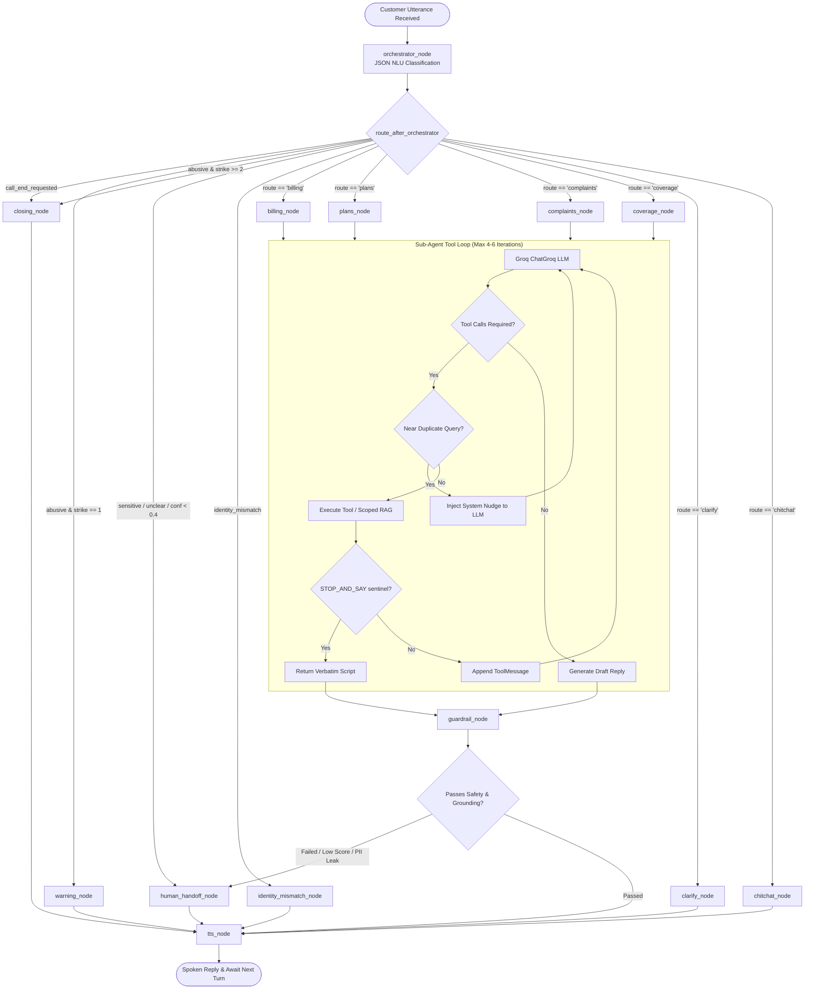

# LangGraph Agentic Architecture & Orchestration

This document is a technical study and reference guide for the multi-agent state machine, conversational routing, tool-calling loops, and orchestration graph in VAY.

---

## 1. Multi-Agent Architectural Overview

VAY operates on a two-tier LangGraph architecture: a central **Orchestrator NLU Node** routes intent to four specialized **Domain Sub-Agents** (Billing, Plans, Complaints, Coverage), supported by guardrail, warning, clarifying, closing, and TTS nodes.



---

## 2. Graph State Schema

**Primary Code Reference:** [`src/vay/graph/state.py`](file:///home/vishvaa/Projects/VAY-multilingual-agent/src/vay/graph/state.py)

The [`GraphState`](file:///home/vishvaa/Projects/VAY-multilingual-agent/src/vay/graph/state.py#L32) TypedDict carries conversational and operational state across all nodes:

```python
# Code snippet from src/vay/graph/state.py
class GraphState(TypedDict, total=False):
    # Customer and Call Metadata
    phone_number: str
    language: str
    transcript: str
    conversation_history: list[BaseMessage]
    
    # NLU / Orchestrator Output
    intent: str
    route: str
    normalized_query: str
    entities: dict[str, Any]
    nlu_confidence: float
    sensitive: bool
    call_end_requested: bool
    
    # Sub-Agent & Execution State
    current_agent: str
    draft_reply: str
    final_reply: str
    retrieval_score: float
    tool_calls_made: list[dict[str, Any]]
    
    # Safety and Handoff State
    handoff: bool
    handoff_reason: str
    session: SessionContext
    barge_in_event: threading.Event
```

---

## 3. Workflow Graph Construction

**Primary Code Reference:** [`src/vay/graph/workflow.py`](file:///home/vishvaa/Projects/VAY-multilingual-agent/src/vay/graph/workflow.py)

The [`build_graph()`](file:///home/vishvaa/Projects/VAY-multilingual-agent/src/vay/graph/workflow.py#L42) function compiles the StateGraph:

```python
# Code snippet from src/vay/graph/workflow.py
builder = StateGraph(GraphState)

# Add Nodes
builder.add_node("orchestrator", orchestrator_node)
builder.add_node("billing", billing_node)
builder.add_node("plans", plans_node)
builder.add_node("complaints", complaints_node)
builder.add_node("coverage", coverage_node)
builder.add_node("guardrail", guardrail_node)
builder.add_node("human_handoff", human_handoff_node)
builder.add_node("tts", tts_node)

# Conditional Routing
builder.add_conditional_edges(
    "orchestrator",
    route_after_orchestrator,
    {
        "billing": "billing",
        "plans": "plans",
        "complaints": "complaints",
        "coverage": "coverage",
        "human_handoff": "human_handoff",
        "clarify": "clarify",
        "warning": "warning",
        "closing": "closing",
        "chitchat": "chitchat",
        "identity_mismatch": "identity_mismatch",
    },
)
```

---

## 4. Orchestrator Node & NLU Classification

**Primary Code Reference:** [`src/vay/graph/nodes/orchestrator.py`](file:///home/vishvaa/Projects/VAY-multilingual-agent/src/vay/graph/nodes/orchestrator.py)

The [`orchestrator_node`](file:///home/vishvaa/Projects/VAY-multilingual-agent/src/vay/graph/nodes/orchestrator.py#L164) prompts the LLM ([`ORCHESTRATOR_SYSTEM_PROMPT`](file:///home/vishvaa/Projects/VAY-multilingual-agent/src/vay/graph/core_utils.py#L32)) and extracts structured JSON:

```json
{
  "language": "ta",
  "intent": "check_balance",
  "route": "billing",
  "normalized_query": "What is my current account balance?",
  "entities": {},
  "confidence": 0.95,
  "sensitive": false,
  "call_end_requested": false,
  "aggressive": false
}
```

### Key Orchestrator Features:
1. **Account Context Pre-Fetch ([`_fetch_account_context`](file:///home/vishvaa/Projects/VAY-multilingual-agent/src/vay/graph/nodes/orchestrator.py#L69))**: Fetches active plan, outstanding balance, and recent tickets directly from SQLite to avoid redundant initial tool calls.
2. **Pending Action Priority**: If `session.pending_action` exists (e.g. unconfirmed plan upgrade), routing is forced back to the originating sub-agent on yes/no affirmations.
3. **Sensitive PII Detection ([`_contains_sensitive_pii`](file:///home/vishvaa/Projects/VAY-multilingual-agent/src/vay/graph/core_utils.py))**: Directly forces human handoff when Aadhaar, card, or bank account numbers appear in the transcript.

---

## 5. Domain Sub-Agents & Tools

**Primary Code References:** [`src/vay/graph/nodes/agents.py`](file:///home/vishvaa/Projects/VAY-multilingual-agent/src/vay/graph/nodes/agents.py), [`src/vay/tools/`](file:///home/vishvaa/Projects/VAY-multilingual-agent/src/vay/tools/)

Each sub-agent runs [`_run_subagent`](file:///home/vishvaa/Projects/VAY-multilingual-agent/src/vay/graph/nodes/orchestrator.py#L350), closing over customer `SessionContext`:

| Sub-Agent Node | Domain Responsibilities | Bound Tools ([`src/vay/tools/`](file:///home/vishvaa/Projects/VAY-multilingual-agent/src/vay/tools/)) | Scoped RAG Collection |
|---|---|---|---|
| [`billing_node`](file:///home/vishvaa/Projects/VAY-multilingual-agent/src/vay/graph/nodes/agents.py#L22) | Invoices, balances, payment links, tariff explanations | `getBalance`, `getBillBreakup`, `getDueDate`, `sendPaymentLink`*, `explainCharge` | `billing_policy` |
| [`plans_node`](file:///home/vishvaa/Projects/VAY-multilingual-agent/src/vay/graph/nodes/agents.py#L38) | Plan upgrades, comparisons, add-ons, validity | `listPlans`, `comparePlans`, `changePlan`*, `activateAddOn`, `checkEligibility` | `product_catalog` |
| [`complaints_node`](file:///home/vishvaa/Projects/VAY-multilingual-agent/src/vay/graph/nodes/agents.py#L54) | Support tickets, SLA checks, troubleshooting | `createComplaint`, `getTicketStatus`, `runTroubleshootFlow`, `escalateToHuman` | `support_faq` |
| [`coverage_node`](file:///home/vishvaa/Projects/VAY-multilingual-agent/src/vay/graph/nodes/agents.py#L70) | Signal strength, tower outages, APN/eSIM setup | `checkCoverage`, `getOutageStatus`, `getDeviceSettings`, `guideSimSwap`, `getTicketStatus` | `technical_kb` |

*\* Sensitive actions requiring two-phase consent verification.*

---

## 6. Bounded Tool-Calling Loop & Optimizations

**Primary Code Reference:** [`src/vay/graph/tool_agent.py`](file:///home/vishvaa/Projects/VAY-multilingual-agent/src/vay/graph/tool_agent.py)

The [`run_tool_agent()`](file:///home/vishvaa/Projects/VAY-multilingual-agent/src/vay/graph/tool_agent.py#L119) function executes tools iteratively up to `MAX_TOOL_ITERATIONS = 4` to `6`:

```python
# Code snippet from src/vay/graph/tool_agent.py
def _is_near_duplicate_query(tool_name: str, args: dict, seen_queries: dict) -> bool:
    new_query = args.get("query")
    if not isinstance(new_query, str):
        return False
    new_tokens = set(re.findall(r"\w+", new_query.lower()))
    for prev_query in seen_queries.get(tool_name, []):
        prev_tokens = set(re.findall(r"\w+", prev_query.lower()))
        jaccard = len(new_tokens & prev_tokens) / len(new_tokens | prev_tokens)
        if jaccard >= 0.50:
            return True # Duplicate detected
    return False
```

### Safety and Latency Optimizations:
1. **Near-Duplicate Query Guard**: Computes Jaccard token overlap (threshold 0.50) on repeated tool search queries to block runaway search loops.
2. **STOP_AND_SAY Sentinel Bypass**: Detects `STOP_AND_SAY:` prefixes returned by sensitive tools and returns the text verbatim, bypassing LLM paraphrasing.
3. **Anti-Repetition Detox ([`_detoxify_repetition`](file:///home/vishvaa/Projects/VAY-multilingual-agent/src/vay/graph/tool_agent.py#L32))**: Prevents small models (`llama-3.1-8b-instant`) from looping repeated phrases when translating numerical data to Indic languages.
4. **Sentence Fragment Guard ([`_is_complete_reply`](file:///home/vishvaa/Projects/VAY-multilingual-agent/src/vay/graph/tool_agent.py#L65))**: Ensures responses do not end with dangling commas or incomplete clauses.

---

## 7. Guardrail Node Verification

**Primary Code Reference:** [`src/vay/graph/nodes/utils.py`](file:///home/vishvaa/Projects/VAY-multilingual-agent/src/vay/graph/nodes/utils.py#L52-L130)

The [`guardrail_node`](file:///home/vishvaa/Projects/VAY-multilingual-agent/src/vay/graph/nodes/utils.py#L52) executes Layer 3 checks before synthesis:
- **Retrieval Confidence Gate**: `retrieval_score < min_similarity` (0.30) -> `human_handoff_node`.
- **Grounded Uncertainty**: `UNCERTAINTY_PATTERNS` match AND `retrieval_score < 0.50` -> `human_handoff_node`.
- **Output PII Check**: `PII_LEAK_PATTERNS` -> `human_handoff_node`.
- **Compliance Policy Scan**: `compliance_policy_search()` for sensitive keywords.

For complete multi-layer guardrail documentation, see [Compliance, Multi-Layer Guardrails & Human Handoff](guardrails_and_handoff.md).
