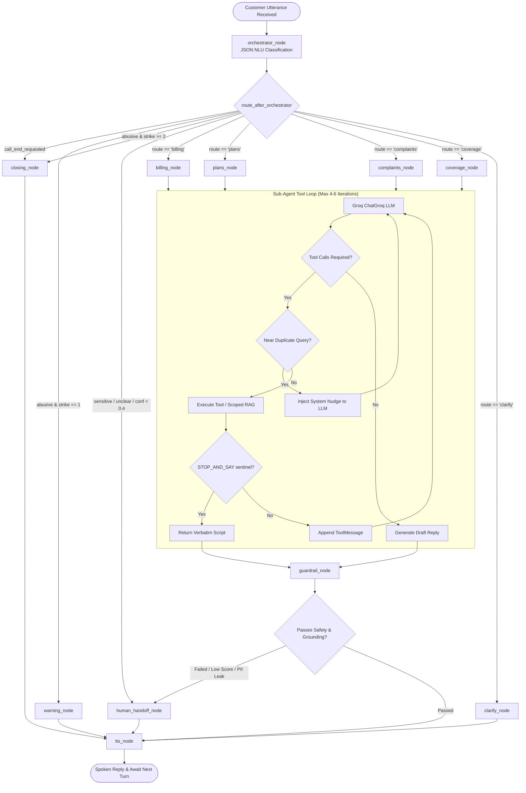

# LangGraph Agentic Architecture & Orchestration

This document details the multi-agent state machine, conversational routing, tool-calling loops, and orchestration graph powering VAY.

---

## 1. Multi-Agent Architectural Overview

VAY operates on a two-tier LangGraph architecture consisting of a central **Orchestrator NLU Node** and four domain-scoped **Sub-Agent Nodes** (Billing, Plans, Complaints, Coverage), complemented by guardrail, clarifying, warning, closing, human handoff, and text-to-speech nodes.



---

## 2. Graph State Schema (`src/vay/graph/state.py`)

All nodes operate over a shared `GraphState` TypedDict maintaining session and multi-turn context:

```python
class GraphState(TypedDict, total=False):
    # Customer and Call Metadata
    phone_number: str
    language: str
    transcript: str
    conversation_history: list[BaseMessage]
    
    # NLU / Orchestrator Output
    intent: str
    route: str
    normalized_query: str
    entities: dict[str, Any]
    confidence: float
    sensitive: bool
    call_end_requested: bool
    abusive: bool
    
    # Execution & Sub-Agent State
    current_agent: str
    draft_reply: str
    final_reply: str
    retrieval_score: float
    tool_calls_made: list[dict[str, Any]]
    
    # Safety and Escalation
    handoff: bool
    handoff_reason: str
    abuse_strike_count: int
    session: SessionContext
```

---

## 3. Orchestrator Node (`src/vay/graph/nodes/orchestrator.py`)

The orchestrator receives the raw transcript and conversation history, outputting strict structured JSON:

```json
{
  "language": "ta",
  "intent": "check_balance",
  "route": "billing",
  "normalized_query": "What is my current account balance?",
  "entities": {},
  "confidence": 0.95,
  "sensitive": false,
  "call_end_requested": false,
  "abusive": false
}
```

### Key Orchestrator Behaviors:
1. **Pending Action Priority**: If `session.pending_action` exists from a prior turn (e.g., an unconfirmed plan upgrade awaiting confirmation), a bare "yes" or "no" transcript is force-routed back to the originating sub-agent without re-classification.
2. **Abuse Multi-Strike Tracking**: Callers using abusive or aggressive language increment `abuse_strike_count`. The first occurrence triggers `warning_node`; a second occurrence triggers polite call termination via `closing_node`.
3. **Safety Confidence Floor**: If orchestrator NLU confidence is below 0.40, the conversation routes directly to `human_handoff_node` or `clarify_node`.

---

## 4. Domain Sub-Agents

Each sub-agent is specialized for a distinct domain of customer care and is bound strictly to its own domain tools and scoped RAG retriever.

### 4.1 Sub-Agent Matrix

| Sub-Agent Node | Domain Responsibility | Bound Tools (`src/vay/tools/`) | Scoped RAG Collection |
|---|---|---|---|
| `billing_node` | Balances, invoices, payments, tariff queries | `getBalance`, `getBillBreakup`, `getDueDate`, `sendPaymentLink`*, `explainCharge` | `billing_policy` |
| `plans_node` | Plan comparisons, upgrades, add-ons, validity | `listPlans`, `comparePlans`, `changePlan`*, `activateAddOn`, `checkEligibility` | `product_catalog` |
| `complaints_node` | Ticket creation, status tracking, SLA inquiries | `createComplaint`, `getTicketStatus`, `runTroubleshootFlow`, `escalateToHuman` | `support_faq` |
| `coverage_node` | Signal checks, tower outages, APN/eSIM setup | `checkCoverage`, `getOutageStatus`, `getDeviceSettings`, `guideSimSwap`, `getTicketStatus` | `technical_kb` |

*\* Requires two-phase code-enforced consent verification.*

---

## 5. Bounded Tool-Calling Loop (`src/vay/graph/tool_agent.py`)

Sub-agents execute tools iteratively up to a bounded limit (`MAX_TOOL_ITERATIONS = 4` to `6`).

### Loop Optimizations and Guardrails:
1. **Near-Duplicate Query Guard (`_is_near_duplicate_query`)**:
   - Calculates Jaccard token overlap (threshold 0.50) over the free-text `query` parameter across successive tool calls within the same turn.
   - Prevents the LLM from executing repeated, slightly reworded searches (e.g., `"postpaid travel plan"` vs `"travel pack requirement"`), saving up to 100+ seconds in unnecessary roundtrips.
2. **STOP_AND_SAY Sentinel**:
   - When a sensitive tool is executed, it returns `STOP_AND_SAY: <consent_script>`.
   - The loop detects this sentinel and returns the exact consent script immediately to the customer, bypassing LLM paraphrasing entirely.
3. **Anti-Repetition Detox (`_detoxify_repetition`)**:
   - Detects looping token patterns in small models (`llama-3.1-8b-instant`), especially when translating numerical figures to Indic languages.
   - Verifies terminal punctuation via `_is_complete_reply()`. If a truncated response is an incomplete sentence fragment, a clean localized fallback message is returned instead.

---

## 6. Guardrail and Compliance Node (`src/vay/graph/nodes/utils.py`)

Before a draft reply is approved for voice synthesis, `guardrail_node` inspects the state:
- **Retrieval Confidence Gate**: Verifies `retrieval_score >= min_similarity` (default 0.30), routing low-confidence answers to `human_handoff_node`.
- **PII Leakage Scan**: Prevents credential, OTP, or token leakage via `PII_LEAK_PATTERNS`.
- **Grounded Uncertainty Check**: Evaluates `UNCERTAINTY_PATTERNS` only when retrieval confidence is below 0.50 (distinguishing appropriate caveating from ignorance).
- **Compliance Policy KB Query**: Queries `compliance_policy` for mandated consent language on sensitive operations (`compliance_policy_search`).
- **Customer Escalation Request**: Checks if the user's transcript explicitly requested a live representative (`HUMAN_REQUEST_PATTERNS`).

For a complete breakdown of all 4 guardrail layers (Input PII scans, Identity mismatch verification, Two-phase consent, and Audit logging), see [Compliance, Multi-Layer Guardrails & Human Handoff](guardrails_and_handoff.md).
