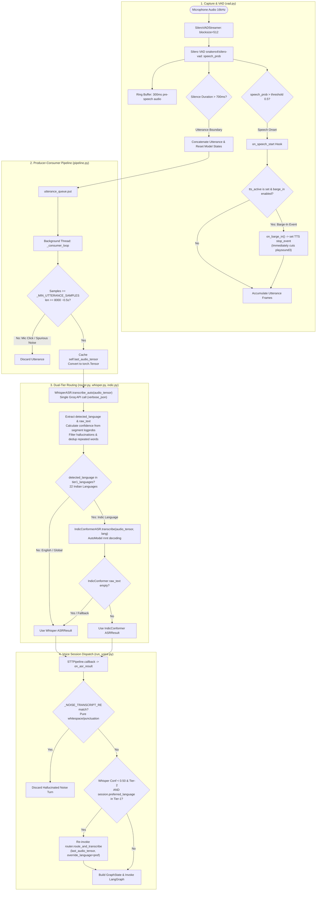

# Speech-to-Text (STT) and ASR Pipeline

This document provides a comprehensive technical breakdown of the Speech-to-Text (STT), Automatic Speech Recognition (ASR), Voice Activity Detection (VAD), and real-time Barge-In (Interruption Handling) architecture implemented in VAY.

---

## 1. Architecture Flowchart

The diagram below reflects the exact data and control flow across `src/vay/audio/vad.py`, `src/vay/audio/pipeline.py`, `src/vay/asr/router.py`, `src/vay/asr/indic.py`, `src/vay/asr/whisper.py`, and `scripts/run_voice.py`.

---

## 2. Voice Activity Detection (VAD) & Real-Time Barge-In

The VAD subsystem isolates speech utterances and dispatches low-latency interruption signals.

### 2.1 Implementation Details (`src/vay/audio/vad.py`)
- **Model**: `snakers4/silero-vad` loaded via `torch.hub.load` and maintained in evaluation mode (`self.model.eval()`).
- **Audio Specification**: 16,000 Hz, 1-channel mono, 32-bit floating point PCM (`sounddevice.InputStream`).
- **Frame Processing**: Evaluates non-overlapping chunks of 512 samples (~32 ms per step).
- **Pre-Speech Buffer**: A 300 ms circular ring buffer (`self.ring_buffer`) preserves the initial vocal onset frames before the VAD threshold is crossed.
- **Utterance Boundary**: An active utterance completes when speech probability remains below `threshold` (0.50) for `min_silence_duration_ms` (700 ms).
- **GRU State Reset**: `self.model.reset_states()` is explicitly invoked after every utterance to prevent recurrent hidden states from accumulating drift across turns.

### 2.2 Barge-In Interruption Mechanics
- **Early Speech Hook (`on_speech_start`)**: Triggered immediately when `speech_prob > threshold` during the waiting state (before waiting for the 700 ms trailing silence).
- **Armed Window (`begin_tts()` / `end_tts()`)**: The `STTPipeline` sets `self.tts_active = True` during assistant speech synthesis and playback.
- **Interruption Signal**: If speech starts while `tts_active` is set and `barge_in_enabled` is True:
  1. `_barge_in_fired` is set to ensure the callback runs at most once per turn.
  2. `self.on_barge_in()` is invoked from the VAD producer thread.
  3. The callback sets the `stop_event` on the running TTS thread, stopping the non-blocking `playsound3` audio playback process within ~50 ms.
- **Acoustic Fallback**: For speaker-only setups without headsets or hardware Acoustic Echo Cancellation (AEC), passing `--no_barge_in` enables the hard `mute()`/`unmute()` path with a 400 ms room-settling delay to prevent speaker echo feedback.

---

## 3. Producer-Consumer Pipeline Architecture (`src/vay/audio/pipeline.py`)

`STTPipeline` manages the asynchronous handoff between the audio capture loop and transcription worker:

1. **Producer Loop (Main Thread)**: Reads chunks from `SileroVADStreamer.stream()` and enqueues completed utterance arrays into `self.utterance_queue`.
2. **Consumer Loop (`_consumer_loop` Background Thread)**:
   - **Minimum Length Guard**: Discards any audio buffer with fewer than `_MIN_UTTERANCE_SAMPLES = 8000` samples (< 0.5 s). This filters out microphone clicks, pops, and residual speaker echo.
   - **Audio Tensor Caching**: Stores `self.last_audio_tensor = torch.from_numpy(utterance)` so downstream error recovery can re-run alternative model passes without re-recording audio.
   - **ASR Routing**: Passes the audio tensor to `ASRRouter.route_and_transcribe()`.
   - **Callback Dispatch**: Dispatches the resulting `ASRResult` to `self.callback`.

---

## 4. Dual-Tier ASR Router & Language Identification (`src/vay/asr/router.py`)

VAY employs a dual-tier model hierarchy to optimize Indian language accuracy and global language support.

| Tier | Covered Languages | Engine | Runtime Execution |
|---|---|---|---|
| **Tier 1** | 22 Scheduled Indian Languages (`ta`, `hi`, `te`, `kn`, `ml`, `mr`, `gu`, `bn`, `pa`, `or`, `as`, `ur`, `sa`, `sd`, `kok`, `ks`, `doi`, `mai`, `mni`, `ne`, `sat`, `brx`) | `ai4bharat/indic-conformer-600m-multilingual` | Local PyTorch `AutoModel` with RNN-T Decoding |
| **Tier 2** | English (`en`) + 90 Global Languages | `openai/whisper-large-v3-turbo` | Groq Cloud API (`whisper-large-v3-turbo`) |

### 4.1 Single-Pass Auto-Transcription (`src/vay/asr/whisper.py`)
- The router invokes `whisper_asr.transcribe_auto(audio_tensor)`.
- `transcribe_auto()` sends the audio tensor as 16-bit 16kHz WAV bytes to Groq Whisper with `response_format="verbose_json"` and no language hint.
- Whisper returns both the detected language (`response.language`) and the full transcription text in **one API round-trip**, cutting latency by ~50% compared to a two-step (detect then transcribe) approach.

### 4.2 Language Normalization & Code Mapping
- `_LANGUAGE_NAME_TO_CODE`: Normalizes full English language names (e.g. `"tamil"` -> `"ta"`, `"hindi"` -> `"hi"`, `"thai"` -> `"th"`).
- `_GROQ_VALID_LANGUAGE_CODES`: Validates recognized ISO codes to avoid API 400 errors.

### 4.3 Tier 1 Execution & Fallback (`src/vay/asr/indic.py`)
- If the detected language belongs to `settings.tier1_languages`:
  1. The router executes `indic_asr.transcribe(audio_tensor, language=detected_lang)`.
  2. `IndicConformerASR` loads `ai4bharat/indic-conformer-600m-multilingual` via `AutoModel.from_pretrained(..., trust_remote_code=True, token=hf_token)` and executes `self.model(audio_tensor.view(1, -1), language, "rnnt")`.
  3. If IndicConformer returns an empty string, the router falls back to the Whisper transcript obtained in step 1.
- If the detected language is Tier 2 (e.g., English), the router returns the Whisper result directly without a second inference pass.

---

## 5. Downstream Session Handling & Recovery (`scripts/run_voice.py`)

When `VoiceCallSession.on_asr_result(result)` receives the transcription:

1. **Noise Transcript Filter**: Evaluates `_NOISE_TRANSCRIPT_RE = r'^[\s.,!?…\-–—\'\"]+$'`. Transcripts consisting solely of punctuation are dropped to prevent spurious chitchat turns.
2. **Account-Aware Low-Confidence Retry**:
   - If Whisper detects a Tier-2 language with low confidence (`confidence < 0.50`), but the customer's database profile (`customers.language_pref`) is an Indic Tier-1 language (e.g. Tamil `ta`), the system re-runs `router.route_and_transcribe(last_audio_tensor, override_language=preferred_lang)`.
   - If IndicConformer yields valid transcribed text, it replaces the low-confidence Whisper output.
3. **Graph State Injection**: Injects `transcript = result.raw_text` and `language = result.detected_language` into `GraphState` and invokes the LangGraph state machine.

---

## 6. Hallucination Filtering (`src/vay/asr/hallucinations.py`)

`WhisperASR.filter_hallucinations(text, language_code)` applies two deterministic cleaning passes:
1. **Consecutive Word Deduplication**: Removes stuttered tokens (`"the the"` -> `"the"`).
2. **Blacklist Matching**: Compares stripped, normalized text against `HALLUCINATION_BLACKLIST` containing known subtitle and silence artifacts (such as `"Thank you for watching"`, `"Subtitles by"`, or `"Amara.org"`). If matched, the text is suppressed to an empty string.

---

## 7. Measured Benchmark Results

Evaluated on 200 Mozilla Common Voice test samples per language:

| Language | Test Samples | Whisper WER (%) | Whisper CER (%) | Whisper Avg Time (s) | IndicConformer WER (%) | IndicConformer CER (%) | IndicConformer Avg Time (s) |
|---|---|---|---|---|---|---|---|
| **Tamil** | 200 | 62.44% | 17.87% | 0.88s | **26.06%** | **5.52%** | 1.65s |
| **Hindi** | 200 | 35.10% | 17.60% | 0.60s | **12.00%** | **6.30%** | 1.12s |
| **English** | 200 | **3.79%** | **7.09%** | **0.32s** | N/A | N/A | N/A |

### Empirical Insights:
- **IndicConformer delivers high accuracy for Indian languages**: **26.06% WER in Tamil** (vs. 62.44% for Whisper) and **12.00% WER in Hindi** (vs. 35.10% for Whisper).
- **Whisper excels at English and Zero-Overhead LID**: **3.79% WER in English** with fast API inference (0.32s).
