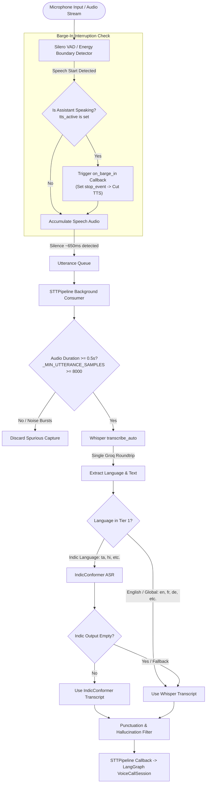

# Speech-to-Text (STT) and ASR Pipeline

This document provides a comprehensive technical breakdown of the Speech-to-Text (STT), Automatic Speech Recognition (ASR), and real-time Barge-In (Interruption Handling) architecture implemented in VAY.

---

## 1. Pipeline Overview

The voice intake pipeline processes real-time audio from the user's microphone or raw audio streams, segments speech through Voice Activity Detection (VAD), handles caller interruptions (Barge-In) over active TTS playback, determines the spoken language without redundant inference, and routes the audio tensor to the optimal ASR engine.



---

## 2. Voice Activity Detection (VAD) & Barge-In

The VAD subsystem isolates conversational utterances and manages interruption signals.

### 2.1 Implementation Details (`src/vay/audio/vad.py`)
- **Engine**: Silero VAD / silence threshold stream detector (`SileroVADStreamer`).
- **Sample Rate**: Standardized to 16,000 Hz mono PCM float32 tensors.
- **Utterance Boundary Detection**: An active speech segment is marked completed when silence persists for ~600 ms to 700 ms after vocal energy.
- **Minimum Duration Gate**: Audio buffers with fewer than 8,000 samples (< 0.5 seconds) are discarded prior to ASR invocation to prevent spurious ambient noise triggers.

### 2.2 Real-Time Barge-In (Interruption Handling)
VAY enables callers to interrupt the assistant mid-sentence rather than forcing them to wait for a long TTS paragraph to complete:
- **`barge_in=True` Mode**: The microphone stream remains open and actively monitored while the assistant speaks.
- **Speech Onset Hook (`on_speech_start`)**: When the VAD detector identifies vocal onset while `tts_active` is set, `STTPipeline._on_speech_start()` immediately executes the `on_barge_in` callback.
- **Immediate Playback Termination**: The callback sets the `stop_event` on the running TTS thread, killing the child `playsound3` audio playback process within ~50ms (`_BARGE_IN_POLL_S = 0.05s`).
- **Headset / Acoustic Considerations**: Full duplex barge-in operates best with headsets or directional microphones. For speaker-only setups without hardware Acoustic Echo Cancellation (AEC), the system provides an optional `barge_in=False` flag that reverts to hard mute/unmute during playback.

---

## 3. Dual-Tier ASR Routing Architecture

To balance multilingual accuracy for Indian languages with low latency and broad global language support, VAY utilizes a dual-tier ASR engine architecture (`src/vay/asr/router.py`).

| Tier | Target Languages | Primary Engine | Backend / Runtime |
|---|---|---|---|
| **Tier 1** | 22 Scheduled Indian Languages (`ta`, `hi`, `te`, `kn`, `ml`, `mr`, `gu`, `bn`, `pa`, `or`, `as`, etc.) | `ai4bharat/indic-conformer-600m-multilingual` | PyTorch `AutoModel` with CTC Decoding |
| **Tier 2** | English (`en`) + 90 Global Languages | `openai/whisper-large-v3-turbo` | Groq Cloud API (`whisper-large-v3-turbo`) |

---

## 4. Model Loading and Execution Specifics

### 4.1 IndicConformer (`src/vay/asr/indic.py`)
- **Model Identifier**: `ai4bharat/indic-conformer-600m-multilingual`
- **Execution Mode**: Direct `AutoModel.from_pretrained(..., trust_remote_code=True)` invocation with explicit language token passing:
  ```python
  model(wav_tensor, language_code, "ctc")
  ```
- **Important Constraint**: HuggingFace `transformers.pipeline()` must not be used with IndicConformer because custom model configuration classes in the remote code cause pipeline instantiation failures.

### 4.2 Whisper Auto-Transcription & Zero-Overhead LID (`src/vay/asr/whisper.py`)
- **Optimized Single-Pass Transcription**: Rather than making a separate LID call followed by a second transcription request, the router calls `transcribe_auto(audio)`.
- **Groq API Response**: Whisper's `verbose_json` returns both the detected language code and full transcription text in a single round-trip:
  ```python
  response = client.audio.transcriptions.create(
      file=("audio.wav", wav_bytes),
      model="whisper-large-v3-turbo",
      response_format="verbose_json",
  )
  detected_lang = response.language
  raw_text = response.text
  ```
- **Latency Gain**: Cuts Whisper turn latency from 2 round-trips (~1.8s) to 1 round-trip (~0.6s - 0.9s).

---

## 5. Language Normalization and Mapping

Groq Whisper frequently returns full language names (for example, `"tamil"`, `"hindi"`, `"thai"`) rather than ISO 639-1 two-letter codes.
- `_LANGUAGE_NAME_TO_CODE`: A dictionary mapping 60+ English language names to ISO 639-1 strings.
- `_GROQ_VALID_LANGUAGE_CODES`: A frozenset validating recognized language tags.
- Fallback resolution ensures that unrecognized language strings do not trigger 400 Bad Request errors in downstream services.

---

## 6. Dynamic Language Switching & State Isolation

In previous versions, a persistent `locked_language` variable could permanently lock the assistant into the first detected language across subsequent turns.

### Current Implementation:
1. **Per-Utterance Detection**: Language is detected dynamically on every turn.
2. **State Cleanup**: `_reset_utterance_state()` runs inside a `try/finally` block on every `route_and_transcribe()` call.
3. **Low-Confidence Retry with Customer Preference**:
   - If Whisper detects a Tier-2 language with confidence < 0.50, but the customer account's registered language in SQLite is a Tier-1 Indic language (such as Tamil), the router re-runs the cached audio tensor through IndicConformer using the registered language code.
   - If IndicConformer yields valid text, it supersedes the low-confidence Whisper output.

---

## 7. Transcript Post-Processing and Hallucination Filtering

Whisper and CTC models can occasionally hallucinate repetitive characters, subtitle credits, or pure punctuation during silence or background hum.

### Filtering Rules (`src/vay/asr/hallucinations.py`):
1. **Punctuation Rejection**: Rejects strings matching `^[\s.,!?…\-–—\'\"]+$`.
2. **Repetition Detox**: Truncates repetitive phrases where small N-grams loop repeatedly.
3. **Common Subtitle Hallucinations**: Strips phrases such as `"Thank you for watching"`, `"Subtitles by"`, or `"Amara.org"`.

---

## 8. Data Contract: ASR to LangGraph

The output of the speech pipeline is encapsulated in a Pydantic `ASRResult` object (`src/vay/types.py`):

```python
class ASRResult(BaseModel):
    raw_text: str
    detected_language: str
    language_tier: LanguageTier  # "tier_1" | "tier_2"
    confidence: float
    model_used: str
```

This model is consumed by `VoiceCallSession.on_asr_result()` and injected directly into `GraphState`:
- `transcript = result.raw_text`
- `language = result.detected_language`

---

## 9. Performance & Accuracy Benchmarks

Evaluated on 200 Mozilla Common Voice test samples per language:

| Language | Number of Samples | Whisper WER (%) | Whisper CER (%) | Whisper Avg Time (s) | IndicConformer WER (%) | IndicConformer CER (%) | IndicConformer Avg Time (s) |
|---|---|---|---|---|---|---|---|
| **Tamil** | 200 | 62.44% | 17.87% | 0.88s | **26.06%** | **5.52%** | 1.65s |
| **Hindi** | 200 | 35.10% | 17.60% | 0.60s | **12.00%** | **6.30%** | 1.12s |
| **English** | 200 | **3.79%** | **7.09%** | **0.32s** | N/A | N/A | N/A |

### Key Takeaways:
- **IndicConformer is essential for Indian languages**: IndicConformer achieves a **58% relative WER reduction in Tamil** (62.44% down to 26.06%) and a **66% relative WER reduction in Hindi** (35.10% down to 12.00%) compared to Whisper Large v3 Turbo.
- **Whisper is optimal for English and Global Fallback**: Near-instant transcription (0.32s) with 3.79% WER.
