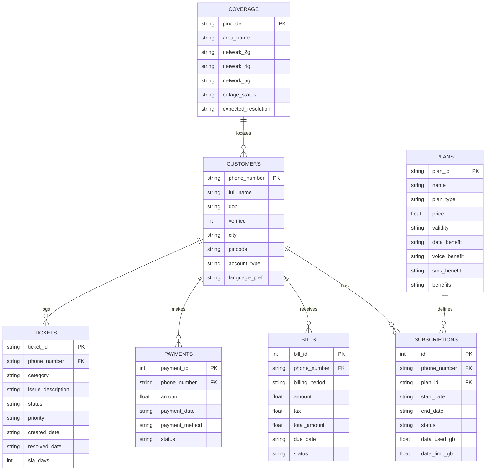

# Customer Database & Tool Backend

This document is a technical study and reference guide for the SQLite database schema, domain tool functions, customer session context, seed data, and operational scripts in VAY.

---

## 1. Database Architecture

**Primary Code References:** [`src/vay/tools/db_schema.py`](file:///home/vishvaa/Projects/VAY-multilingual-agent/src/vay/tools/db_schema.py), [`src/vay/tools/db_queries.py`](file:///home/vishvaa/Projects/VAY-multilingual-agent/src/vay/tools/db_queries.py)

VAY maintains an embedded SQLite database (`src/vay/tools/nexatel_customers.db`) representing the telecommunications core backend.



---

## 2. Customer Session Context & Tool Factories

**Primary Code Reference:** [`src/vay/tools/session.py`](file:///home/vishvaa/Projects/VAY-multilingual-agent/src/vay/tools/session.py)

The [`SessionContext`](file:///home/vishvaa/Projects/VAY-multilingual-agent/src/vay/tools/session.py#L35) dataclass encapsulates the caller's immutable identity and pending transaction state:

```python
# Code snippet from src/vay/tools/session.py
@dataclass
class SessionContext:
    phone_number: str
    verified: bool = True
    language: str = "en"
    preferred_language: str = "en"
    escalation_requested: bool = False
    escalation_reason: str = ""
    pending_action: dict[str, Any] | None = None
    aggressive_count: int = 0
```

- **Tool Closure**: Domain tool factories ([`build_billing_tools(session)`](file:///home/vishvaa/Projects/VAY-multilingual-agent/src/vay/tools/billing.py), [`build_plans_tools(session)`](file:///home/vishvaa/Projects/VAY-multilingual-agent/src/vay/tools/plans.py)) close over `SessionContext`. The LLM cannot specify or alter the account phone number.

---

## 3. Domain Tool Catalog

### 3.1 Billing Tools
**Primary Code Reference:** [`src/vay/tools/billing.py`](file:///home/vishvaa/Projects/VAY-multilingual-agent/src/vay/tools/billing.py)

- [`getBalance()`](file:///home/vishvaa/Projects/VAY-multilingual-agent/src/vay/tools/billing.py#L25): Returns account balance, quota, validity, or unpaid postpaid bills.
- [`getBillBreakup()`](file:///home/vishvaa/Projects/VAY-multilingual-agent/src/vay/tools/billing.py#L65): Itemizes tariff, taxes, roaming charges, and add-on fees.
- [`getDueDate()`](file:///home/vishvaa/Projects/VAY-multilingual-agent/src/vay/tools/billing.py#L90): Retrieves next invoice due date.
- [`sendPaymentLink()`](file:///home/vishvaa/Projects/VAY-multilingual-agent/src/vay/tools/billing.py#L105): Stages an SMS payment link (Two-Phase Consent).
- [`explainCharge(charge_type)`](file:///home/vishvaa/Projects/VAY-multilingual-agent/src/vay/tools/billing.py#L130): Clarifies recurring or roaming billing charges.

### 3.2 Plans & Subscription Tools
**Primary Code Reference:** [`src/vay/tools/plans.py`](file:///home/vishvaa/Projects/VAY-multilingual-agent/src/vay/tools/plans.py)

- [`listPlans(plan_type=None)`](file:///home/vishvaa/Projects/VAY-multilingual-agent/src/vay/tools/plans.py#L25): Queries catalog for prepaid, postpaid, or broadband plans.
- [`comparePlans(plan_id_1, plan_id_2)`](file:///home/vishvaa/Projects/VAY-multilingual-agent/src/vay/tools/plans.py#L55): Generates side-by-side feature comparisons.
- [`changePlan(new_plan_id)`](file:///home/vishvaa/Projects/VAY-multilingual-agent/src/vay/tools/plans.py#L85): Stages a subscription upgrade/change (Two-Phase Consent).
- [`activateAddOn(addon_id)`](file:///home/vishvaa/Projects/VAY-multilingual-agent/src/vay/tools/plans.py#L115): Attaches data boosters or OTT packs.
- [`checkEligibility(plan_id)`](file:///home/vishvaa/Projects/VAY-multilingual-agent/src/vay/tools/plans.py#L140): Checks prepaid-to-postpaid migration eligibility.

### 3.3 Support & Complaints Tools
**Primary Code Reference:** [`src/vay/tools/complaints.py`](file:///home/vishvaa/Projects/VAY-multilingual-agent/src/vay/tools/complaints.py)

- [`createComplaint(category, issue_description)`](file:///home/vishvaa/Projects/VAY-multilingual-agent/src/vay/tools/complaints.py#L25): Opens a support ticket with SLA target calculations.
- [`getTicketStatus(ticket_id=None)`](file:///home/vishvaa/Projects/VAY-multilingual-agent/src/vay/tools/complaints.py#L65): Fetches resolution status and notes for open/resolved tickets.
- [`runTroubleshootFlow(issue_type)`](file:///home/vishvaa/Projects/VAY-multilingual-agent/src/vay/tools/complaints.py#L95): Returns step-by-step diagnostic workflows for data, voice, or SMS issues.
- [`escalateToHuman(reason)`](file:///home/vishvaa/Projects/VAY-multilingual-agent/src/vay/tools/complaints.py#L120): Explicitly flags the session for human agent transfer.

### 3.4 Technical & Coverage Tools
**Primary Code Reference:** [`src/vay/tools/coverage.py`](file:///home/vishvaa/Projects/VAY-multilingual-agent/src/vay/tools/coverage.py)

- [`checkCoverage(pincode=None)`](file:///home/vishvaa/Projects/VAY-multilingual-agent/src/vay/tools/coverage.py#L25): Checks 4G/5G tower signal availability.
- [`getOutageStatus(pincode=None)`](file:///home/vishvaa/Projects/VAY-multilingual-agent/src/vay/tools/coverage.py#L55): Returns active area outages and estimated restoration times.
- [`getDeviceSettings(os_type)`](file:///home/vishvaa/Projects/VAY-multilingual-agent/src/vay/tools/coverage.py#L85): Returns iOS/Android APN and VoLTE configuration steps.
- [`guideSimSwap()`](file:///home/vishvaa/Projects/VAY-multilingual-agent/src/vay/tools/coverage.py#L110): Guides customer through SIM activation and security lock periods.

---

## 4. Seed Data & Test Profiles

**Primary Code Reference:** [`src/vay/tools/db_seed_data.py`](file:///home/vishvaa/Projects/VAY-multilingual-agent/src/vay/tools/db_seed_data.py)

| Phone Number | Customer Name | Preferred Language | Account Type | Active Plan | Scenario Profile |
|---|---|---|---|---|---|
| `9876543210` | Vishwa Raj | `ta` (Tamil) | Prepaid | `PPD_VALUE` (Rs 299) | Standard Tamil voice demo account |
| `9876500001` | Aarav Sharma | `hi` (Hindi) | Prepaid | `PPD_BASIC` (Rs 239) | Hindi prepaid user with low balance |
| `9876500002` | Priya Patel | `en` (English) | Postpaid | `PST_PREMIUM` (Rs 999) | Postpaid user with high data usage |
| `9876500003` | Rajesh Kumar | `hi` (Hindi) | Postpaid | `PST_FAMILY` (Rs 1499) | Overdue invoice, disputed roaming charge |
| `9876500004` | Ananya Sundaram | `ta` (Tamil) | Prepaid | `PPD_UNLIMITED` (Rs 499) | Open technical complaint ticket |
| `9876500005` | Vikram Singh | `en` (English) | Broadband | `BB_GIGA` (Rs 1299) | Active area fiber outage in pincode `110001` |

---

## 5. Automated Environment Setup & CLI

**Primary Code References:** [`scripts/setup_app.py`](file:///home/vishvaa/Projects/VAY-multilingual-agent/scripts/setup_app.py), [`scripts/manage_db.py`](file:///home/vishvaa/Projects/VAY-multilingual-agent/scripts/manage_db.py)

```bash
# 1. Master all-in-one setup (Seeds DB, Builds KB, Caches ASR Models, Launches UI)
uv run python scripts/setup_app.py

# 2. Granular DB Operations
uv run python scripts/manage_db.py --seed
uv run python scripts/manage_db.py --phone 9876543210
uv run python scripts/manage_db.py --reset
```
