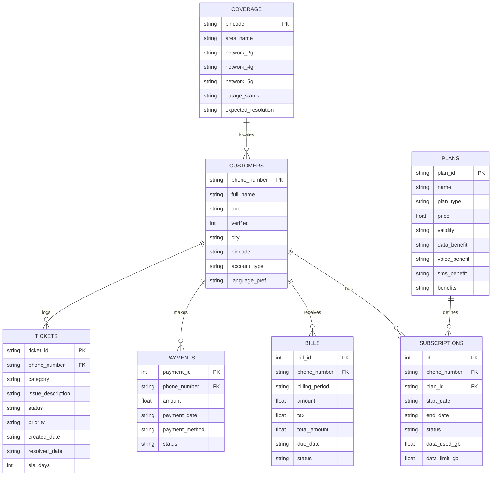

# Customer Database & Tool Backend

This document details the SQLite database schema, domain tool functions, customer session lifecycle, seed records, and automated environment initialization scripts implemented in VAY.

---

## 1. Database Architecture (`src/vay/tools/db_schema.py`)

VAY maintains an embedded SQLite database (`src/vay/tools/nexatel_customers.db`) representing the core telecommunications business backend.



---

## 2. Domain Tool Catalog

Each sub-agent interacts with the SQLite database via dedicated Python tool functions that close over the caller's `SessionContext`.

### 2.1 Billing Tools (`src/vay/tools/billing.py`)
- `getBalance()`: Fetches current balance, data usage vs quota, validity end date, or outstanding postpaid invoice totals.
- `getBillBreakup()`: Details line-item bill charges (base tariff, taxes, add-ons, roaming fees).
- `getDueDate()`: Retrieves current billing cycle due dates.
- `sendPaymentLink()`: Generates a secure payment link via SMS (triggers Two-Phase Consent).
- `explainCharge(charge_type)`: Clarifies recurring or one-time charges against billing policy.

### 2.2 Plans & Subscription Tools (`src/vay/tools/plans.py`)
- `listPlans(plan_type=None)`: Returns active prepaid, postpaid, or broadband plans.
- `comparePlans(plan_id_1, plan_id_2)`: Generates a side-by-side feature and price comparison.
- `changePlan(new_plan_id)`: Stages a plan upgrade or switch (triggers Two-Phase Consent).
- `activateAddOn(addon_id)`: Adds data booster or roaming packs.
- `checkEligibility(plan_id)`: Verifies if the customer's account meets migration requirements.

### 2.3 Complaints & Support Tools (`src/vay/tools/complaints.py`)
- `createComplaint(category, issue_description)`: Opens a support ticket and calculates SLA resolution deadlines based on category.
- `getTicketStatus(ticket_id=None)`: Checks status, SLA remaining, and resolution notes for existing or latest tickets.
- `runTroubleshootFlow(issue_type)`: Returns step-by-step diagnostic procedures for slow data, call drops, or SMS failure.
- `escalateToHuman(reason)`: Explicitly triggers escalation to a human representative.

### 2.4 Technical & Coverage Tools (`src/vay/tools/coverage.py`)
- `checkCoverage(pincode=None)`: Returns 4G/5G signal coverage and tower status for a specific pincode.
- `getOutageStatus(pincode=None)`: Returns active unplanned tower outages and estimated restoration times.
- `getDeviceSettings(os_type)`: Provides step-by-step APN, VoLTE, and eSIM installation instructions for iOS and Android.
- `guideSimSwap()`: Guides customer through SIM activation and security waiting periods.

---

## 3. Seed Data & Test Accounts (`src/vay/tools/db_seed_data.py`)

The database is seeded with representative accounts covering diverse scenarios:

| Phone Number | Customer Name | Preferred Language | Account Type | Active Plan | Scenario Profile |
|---|---|---|---|---|---|
| `9876543210` | Vishwa Raj | `ta` (Tamil) | Prepaid | `PPD_VALUE` (Rs 299) | Standard Tamil voice demo account |
| `9876500001` | Aarav Sharma | `hi` (Hindi) | Prepaid | `PPD_BASIC` (Rs 239) | Hindi prepaid user with low balance |
| `9876500002` | Priya Patel | `en` (English) | Postpaid | `PST_PREMIUM` (Rs 999) | Postpaid user with high data usage |
| `9876500003` | Rajesh Kumar | `hi` (Hindi) | Postpaid | `PST_FAMILY` (Rs 1499) | Overdue invoice, disputed roaming charge |
| `9876500004` | Ananya Sundaram | `ta` (Tamil) | Prepaid | `PPD_UNLIMITED` (Rs 499) | Open technical complaint ticket |
| `9876500005` | Vikram Singh | `en` (English) | Broadband | `BB_GIGA` (Rs 1299) | Active area fiber outage in pincode `110001` |

---

## 4. Initialization and Management Scripts

### 4.1 Master Setup & Startup Script (`scripts/setup_app.py`)
The recommended single-command startup script automates the complete initialization lifecycle:
1. Calls `init_db()` to seed all SQLite tables.
2. Invokes `scripts/build_kb.py` to build and verify ChromaDB collections.
3. Instantiates `IndicConformerASR` to cache HuggingFace weights locally.
4. Starts the Streamlit Web Application (`app.py`).

```bash
uv run python scripts/setup_app.py
```

### 4.2 Granular Database CLI (`scripts/manage_db.py`)
```bash
# Seed the database with default customer and plan records
uv run python scripts/manage_db.py --seed

# Inspect customer record and active subscriptions
uv run python scripts/manage_db.py --phone 9876543210

# Reset and wipe database cleanly
uv run python scripts/manage_db.py --reset
```
