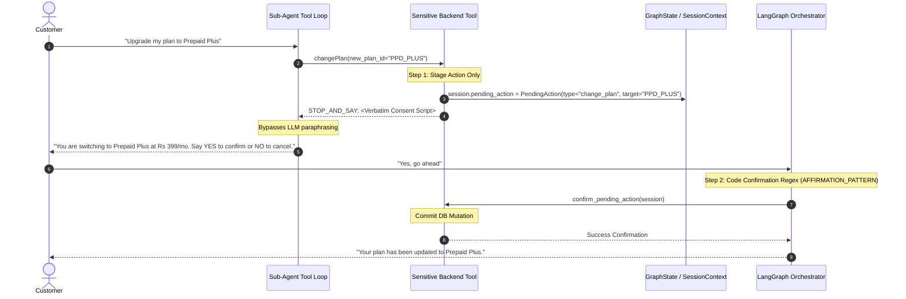
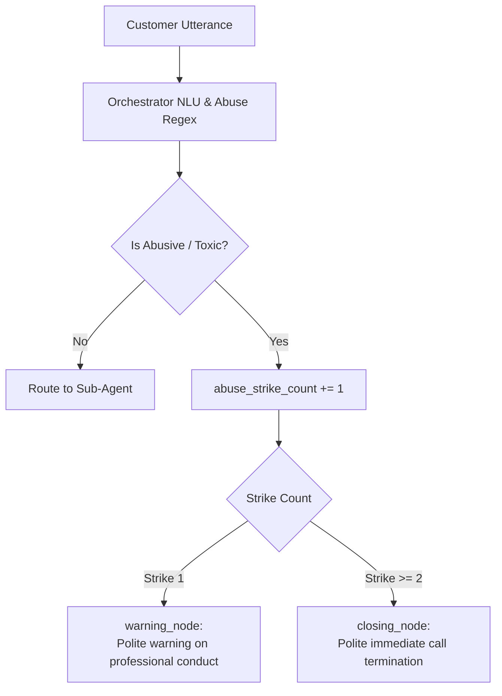

# Compliance, Guardrails & Human Handoff

This document details the safety, privacy, regulatory compliance, and escalation mechanisms implemented in VAY.

---

## 1. Compliance-Critical Two-Phase Consent

In telecommunications self-service, destructive or financial actions (such as changing a subscription plan or generating payment links) must never be executed solely based on LLM autonomous judgment. VAY enforces a **Two-Phase, Code-Enforced Consent Gate**.



### Safety Principles of the Consent Gate:
1. **Tool Staging**: The initial tool call never mutates the database. It stores a `pending_action` in `SessionContext` and returns a `STOP_AND_SAY:` prefixed template.
2. **Verbatim Script Delivery**: `run_tool_agent()` detects `STOP_AND_SAY:` and immediately returns the exact text, preventing the LLM from omitting terms or disclaimers.
3. **Deterministic Confirmation**: Confirmation is evaluated using exact regular expressions (`AFFIRMATION_PATTERN = r"^\s*(yes|confirm|agree|proceed|sure|ok|ஆம்|சரி|हाँ|स्वीकार|ha|haan)\b"`) on the customer's next-turn transcript. The LLM is never asked to judge whether the user consented.
4. **Identity Verification Gate**: Both `changePlan` and `sendPaymentLink` abort immediately with `SENSITIVE_DENIAL` if `session.verified` is `False`.

---

## 2. Session Context Isolation

To prevent prompt injection and unauthorized cross-account access:
- **Immutable Identifier**: The caller's phone number is bound to the `SessionContext` dataclass at session initialization (`scripts/run_voice.py` or `scripts/run_assistant.py`).
- **Tool Closure**: Domain tool factories (`build_billing_tools(session)`, `build_plans_tools(session)`) close over the `SessionContext`.
- **No LLM-Provided Phone Numbers**: Sub-agents can only specify operational arguments (`plan_id`, `pincode`, `ticket_id`). The LLM cannot specify or alter the target account phone number.

---

## 3. Real-Time Output Guardrails (`src/vay/graph/nodes/utils.py`)

All draft responses generated by sub-agents pass through `guardrail_node` before reaching Text-to-Speech synthesis:

| Guardrail Check | Rule / Trigger Condition | Resolution Action |
|---|---|---|
| **Low Retrieval Confidence** | `retrieval_score < DEFAULT_MIN_SIMILARITY` (0.30) | Route to `human_handoff_node` |
| **PII & Credential Leakage** | Matches regex patterns for OTPs, CVVs, passwords, or raw session tokens | Replace with safe message, route to handoff |
| **Model Uncertainty Phrases** | Matches `"I don't have access"`, `"As an AI language model"`, `"I cannot assist"` | Route to `human_handoff_node` |
| **Explicit Escalation Request** | Customer utterance contains `"human"`, `"agent"`, `"manager"`, `"representative"` | Route to `human_handoff_node` |

---

## 4. Abuse and Toxicity Multi-Strike Policy

VAY distinguishes between frustrated customers (who should receive assistance or escalation) and abusive callers using profanity or hostile language.



- **Strike 1**: The assistant issues a polite, firm warning requesting professional communication while keeping the session open.
- **Strike 2+**: The assistant terminates the call cleanly via `closing_node`. Abusive callers are deliberately **not** transferred to human agents to protect call center staff.

---

## 5. Human Handoff Queue & Context Logging

When an escalation occurs, `human_handoff_node` creates a complete context packet logged to `handoff_log.jsonl`:

```json
{
  "timestamp": "2026-08-18T14:32:01.452120",
  "phone_number": "9876543210",
  "language": "ta",
  "intent": "dispute_charge",
  "route": "billing",
  "reason": "retrieval_confidence_below_threshold",
  "transcript": "Why was I charged 150 rupees extra on my bill?",
  "entities": {},
  "conversation_history_length": 4,
  "draft_reply": "..."
}
```

The customer is spoken a polite localized handoff notification (`HANDOFF_MESSAGE_TEMPLATES`), and the session cleanly terminates to allow human representative takeover.
