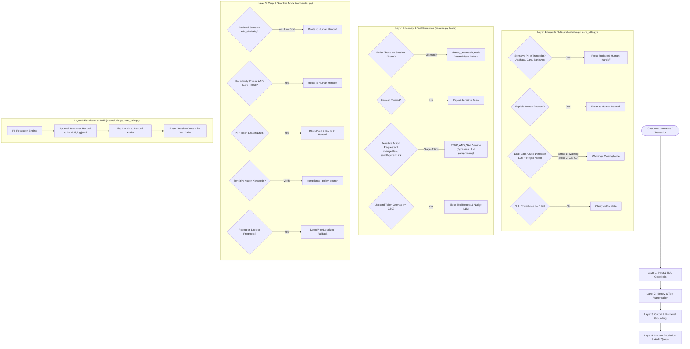
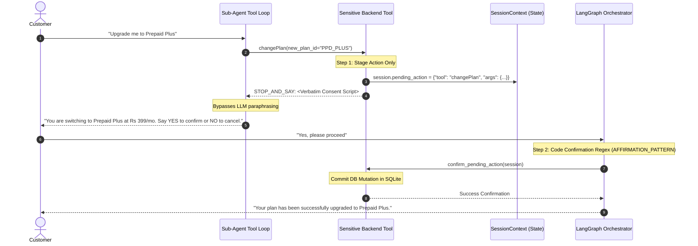

# Compliance, Multi-Layer Guardrails & Human Handoff

This document is a technical study and reference guide for the safety policies, identity verification, 4-layer guardrail architecture, and human escalation mechanisms in VAY.

---

## 1. Multi-Layer Guardrail Architecture

To ensure zero hallucination on sensitive customer accounts, prevent credential leakage, and maintain strict telecommunications regulatory compliance, VAY implements a **4-Layer Defense-in-Depth Guardrail System**.



---

## 2. Layer 1: Input & NLU Guardrails

**Primary Code References:** [`src/vay/graph/nodes/orchestrator.py`](file:///home/vishvaa/Projects/VAY-multilingual-agent/src/vay/graph/nodes/orchestrator.py), [`src/vay/graph/core_utils.py`](file:///home/vishvaa/Projects/VAY-multilingual-agent/src/vay/graph/core_utils.py)

### 2.1 Sensitive PII Disclosure Guardrail
The [`_contains_sensitive_pii()`](file:///home/vishvaa/Projects/VAY-multilingual-agent/src/vay/graph/core_utils.py#L420) function inspects the raw transcript before routing to sub-agents:

```python
# Code snippet from src/vay/graph/core_utils.py
def _contains_sensitive_pii(text: str) -> str | None:
    # 1. Aadhaar (12-digit Indian national identity)
    if re.search(r"\b\d{4}\s?\d{4}\s?\d{4}\b", text):
        return "PII disclosure: 12-digit Aadhaar number detected in transcript."
    # 2. Payment Card Numbers (13-19 digits, Visa/MasterCard/RuPay/Amex)
    for match in re.finditer(r"\b(?:\d[ -]?){13,19}\b", text):
        digits = re.sub(r"\D", "", match.group(0))
        if _is_luhn_valid(digits):
            return "PII disclosure: payment card number detected in transcript."
    # 3. CVVs, Bank Accounts, Passwords
    ...
```

- **Enforcement**: When sensitive PII is detected, the orchestrator immediately sets `sensitive = True`, forcing `human_handoff_node`.
- **Redaction**: Transcript PII is redacted via [`_redact_pii()`](file:///home/vishvaa/Projects/VAY-multilingual-agent/src/vay/graph/core_utils.py#L460) before logging to `handoff_log.jsonl`.

### 2.2 Dual-Gate Abuse Policy
```python
# Code snippet from src/vay/graph/nodes/orchestrator.py
aggressive = bool(parsed.get("aggressive", False)) and bool(
    ABUSIVE_LANGUAGE_PATTERN.search(state["transcript"])
)
```
- **Gate 1**: Orchestrator LLM outputs `"aggressive": true`.
- **Gate 2 (Deterministic)**: Raw transcript matches [`ABUSIVE_LANGUAGE_PATTERN`](file:///home/vishvaa/Projects/VAY-multilingual-agent/src/vay/graph/core_utils.py#L380).
- **Strike Policy**: Strike 1 issues a polite warning ([`warning_node`](file:///home/vishvaa/Projects/VAY-multilingual-agent/src/vay/graph/nodes/utils.py#L197)); Strike 2 cleanly ends the call ([`closing_node`](file:///home/vishvaa/Projects/VAY-multilingual-agent/src/vay/graph/nodes/utils.py#L241)). Abusive callers are **never** transferred to human agents.

---

## 3. Layer 2: Identity & Tool Authorization Guardrails

**Primary Code References:** [`src/vay/tools/session.py`](file:///home/vishvaa/Projects/VAY-multilingual-agent/src/vay/tools/session.py), [`src/vay/graph/nodes/orchestrator.py`](file:///home/vishvaa/Projects/VAY-multilingual-agent/src/vay/graph/nodes/orchestrator.py#L257)

### 3.1 Identity Mismatch Guardrail
```python
# Code snippet from src/vay/graph/nodes/orchestrator.py
if norm_entity_phone and norm_session_phone and norm_entity_phone != norm_session_phone:
    identity_mismatch_reply = localized(IDENTITY_MISMATCH_TEMPLATES, detected_lang)
    # Routes to identity_mismatch_node, bypassing all sub-agents and tools
```

- Prevents a caller from querying or mutating another customer's account by naming a different phone number.

### 3.2 Two-Phase Code-Enforced Consent Gate



```python
# Code snippet from src/vay/tools/plans.py
def changePlan(new_plan_id: str) -> str:
    if not session.verified:
        return SENSITIVE_DENIAL
    session.pending_action = {"tool": "changePlan", "new_plan_id": new_plan_id}
    return "STOP_AND_SAY: " + consent_script("change_plan", session.language, plan_name=new_plan_id)
```

- **Confirmation Regex**: The next turn's transcript is evaluated with [`AFFIRMATION_PATTERN`](file:///home/vishvaa/Projects/VAY-multilingual-agent/src/vay/graph/core_utils.py#L350) and [`NEGATION_PATTERN`](file:///home/vishvaa/Projects/VAY-multilingual-agent/src/vay/graph/core_utils.py#L355). Confirmation is strictly code-driven.

---

## 4. Layer 3: Output & Retrieval Grounding Guardrails

**Primary Code Reference:** [`src/vay/graph/nodes/utils.py`](file:///home/vishvaa/Projects/VAY-multilingual-agent/src/vay/graph/nodes/utils.py#L52-L130)

The [`guardrail_node`](file:///home/vishvaa/Projects/VAY-multilingual-agent/src/vay/graph/nodes/utils.py#L52) executes Layer 3 checks before synthesis:

```python
# Code snippet from src/vay/graph/nodes/utils.py
def guardrail_node(state: GraphState) -> GraphState:
    # 1. Retrieval confidence floor check
    if retrieval_score < min_similarity:
        return {"handoff": True, "handoff_reason": f"Low retrieval confidence ({retrieval_score:.2f} < {min_similarity})."}
    
    # 2. Customer explicit request for human agent in transcript
    if HUMAN_REQUEST_PATTERNS.search(state["transcript"]):
        return {"handoff": True, "handoff_reason": "Customer requested a human agent."}
    
    # 3. Grounded uncertainty check (only flags if retrieval score < 0.50)
    if UNCERTAINTY_PATTERNS.search(draft) and retrieval_score < 0.50:
        return {"handoff": True, "handoff_reason": "Assistant signaled uncertainty with low retrieval confidence."}
    
    # 4. Output PII & Credential leak check
    if PII_LEAK_PATTERNS.search(draft):
        return {"handoff": True, "handoff_reason": "Draft reply referenced sensitive credentials (guardrail block)."}
    
    return {"final_reply": draft}
```

---

## 5. Layer 4: Human Escalation & Audit Queue

**Primary Code Reference:** [`src/vay/graph/nodes/utils.py`](file:///home/vishvaa/Projects/VAY-multilingual-agent/src/vay/graph/nodes/utils.py#L140-L166)

The [`human_handoff_node`](file:///home/vishvaa/Projects/VAY-multilingual-agent/src/vay/graph/nodes/utils.py#L140) logs context packets to `handoff_log.jsonl` using [`log_handoff()`](file:///home/vishvaa/Projects/VAY-multilingual-agent/src/vay/graph/core_utils.py#L510):

```json
{
  "timestamp": "2026-08-18T14:32:01.452120",
  "phone_number": "9876543210",
  "language": "ta",
  "intent": "dispute_charge",
  "route": "billing",
  "reason": "Low retrieval confidence (0.24 < 0.30).",
  "transcript": "Why was I charged 150 rupees extra on my bill?",
  "entities": {
    "charge_type": "roaming"
  },
  "normalized_query": "Explain roaming charge dispute",
  "draft_reply_at_handoff": "..."
}
```

- **Clean Session Reset**: Following handoff audio synthesis, conversational state and `SessionContext` are cleared to prevent state bleeding into future interactions.
