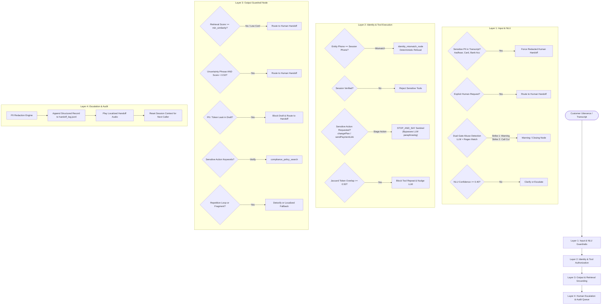
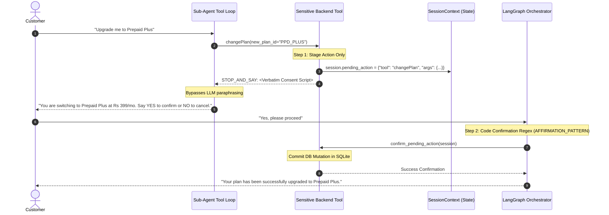

# Compliance, Multi-Layer Guardrails & Human Handoff

This document provides a comprehensive technical breakdown of the safety, compliance, identity verification, multi-layer guardrails, and human escalation mechanisms implemented in VAY.

---

## 1. Multi-Layer Guardrail Architecture

To ensure zero hallucination on sensitive customer accounts, prevent credential leakage, and maintain strict telecommunications regulatory compliance, VAY implements a **4-Layer Defense-in-Depth Guardrail System**.



---

## 2. Layer 1: Input & NLU Guardrails

Input guardrails inspect the raw customer transcript before any domain sub-agent, tool, or database query is executed.

### 2.1 Sensitive PII Disclosure Guardrail (`_contains_sensitive_pii`)
- **Inspection Target**: Raw transcript string.
- **Pattern Coverage**:
  - **Aadhaar Numbers**: 12-digit Indian national identity numbers (`\b\d{4}\s?\d{4}\s?\d{4}\b`).
  - **Payment Card Numbers**: 13-19 digit Visa, MasterCard, RuPay, and Amex numbers validated against regex and format checks.
  - **CVV / Security Codes**: 3-4 digit card verification values.
  - **Bank Account / Passwords**: Raw credential patterns.
- **Enforcement**: If sensitive PII is spoken by the customer, the orchestrator immediately marks `sensitive = True`, bypassing all domain sub-agents and routing directly to `human_handoff_node`. The raw transcript is redacted prior to escalation logging.

### 2.2 Dual-Gate Abuse & Toxicity Policy
To protect against false positives from small LLM classifiers while maintaining a safe environment:
1. **Gate 1**: The orchestrator LLM outputs `"aggressive": true`.
2. **Gate 2 (Deterministic)**: The raw transcript must match `ABUSIVE_LANGUAGE_PATTERN` (profanity, hostile insults, or harassment terms).
- **Strike 1 (Warning)**: The assistant issues a polite, firm warning (`warning_node`) asking the customer to maintain professional communication.
- **Strike 2+ (Call Termination)**: The assistant politely ends the call (`closing_node`) using deterministic `CALL_CUT_TEMPLATES`. Abusive callers are **not** transferred to human agents.

### 2.3 Low-Confidence & Clarification Gate
- If orchestrator NLU confidence is below `DEFAULT_NLU_CONFIDENCE` (0.40) or the intent is ambiguous:
  - **Turn 1**: The assistant reprompts the user politely using `clarify_node` (`CLARIFY_TEMPLATES`).
  - **Turn 2+ (`UNCLEAR_ESCALATION_THRESHOLD = 2`)**: If the caller remains unclear across consecutive turns, the call escalates cleanly to a human representative.

---

## 3. Layer 2: Identity & Tool Authorization Guardrails

Layer 2 ensures that sub-agents cannot act beyond their authorization scope or mutate customer accounts without explicit verification.

### 3.1 Identity Mismatch Guardrail
- **Session-Bound Identity**: The caller's phone number is bound once to `SessionContext` at call intake and is immutable.
- **Entity Verification**: If NLU extracts an explicit target phone number from user speech (e.g. *"Change the plan on my friend's number 9876543210"*), the orchestrator compares `_normalize_phone(entity_phone)` against `_normalize_phone(session.phone_number)`.
- **Deterministic Refusal**: If a mismatch is detected, `identity_mismatch_node` executes immediately, speaking a fixed refusal (`IDENTITY_MISMATCH_TEMPLATES`) and logging the audit event without executing any backend tools.

### 3.2 Two-Phase Code-Enforced Consent Gate



- **Staging Only**: Sensitive tools (`changePlan`, `sendPaymentLink`) never mutate the database on their initial call.
- **Verbatim Delivery**: The `STOP_AND_SAY:` sentinel bypasses LLM prompt formatting, ensuring mandatory regulatory terms are delivered verbatim.
- **Deterministic Confirmation**: The next turn's transcript is evaluated with exact regular expressions:
  - `AFFIRMATION_PATTERN`: `r"^\s*(yes|confirm|agree|proceed|sure|ok|ஆம்|சரி|हाँ|स्वीकार|ha|haan)\b"`
  - `NEGATION_PATTERN`: `r"^\s*(no|cancel|stop|dont|don't|இல்லை|வேண்டாம்|नहीं|रद्द)\b"`
  The decision to commit the transaction is strictly code-driven and never delegated to LLM interpretation.

---

## 4. Layer 3: Output & Retrieval Grounding Guardrails (`guardrail_node`)

Before any draft reply is approved for voice synthesis, `guardrail_node` executes comprehensive safety checks:

| Guardrail Check | Trigger Condition | Enforcement Action |
|---|---|---|
| **Retrieval Confidence Gate** | `retrieval_score < DEFAULT_MIN_SIMILARITY` (0.30) | Mark `handoff = True`, route to `human_handoff_node` |
| **Grounded Uncertainty Check** | `UNCERTAINTY_PATTERNS.search(draft)` AND `retrieval_score < 0.50` | Route to `human_handoff_node` (allows appropriate caveating if score >= 0.50) |
| **Output PII Leakage** | `PII_LEAK_PATTERNS.search(draft)` (API keys, tokens, OTPs, raw DB rows) | Suppress draft, route to `human_handoff_node` |
| **Compliance Policy Check** | Draft contains sensitive keywords (`change plan`, `payment link`, `cancel`) | Queries `compliance_policy` via `compliance_policy_search()` to verify consent terms |
| **Anti-Repetition Detox** | `_detoxify_repetition` detects token loop; `_is_complete_reply` validates punctuation | Truncates loop or substitutes safe localized fallback |

---

## 5. Layer 4: Human Escalation & Audit Queue

When an escalation occurs from any layer, `human_handoff_node` logs a complete, auditable incident packet to `handoff_log.jsonl`.

### 5.1 Redacted Context Packet Structure

```json
{
  "timestamp": "2026-08-18T14:32:01.452120",
  "phone_number": "9876543210",
  "language": "ta",
  "intent": "dispute_charge",
  "route": "billing",
  "reason": "Low retrieval confidence (0.24 < 0.30).",
  "transcript": "Why was I charged 150 rupees extra on my bill?",
  "entities": {
    "charge_type": "roaming"
  },
  "normalized_query": "Explain roaming charge dispute",
  "draft_reply_at_handoff": "..."
}
```

### 5.2 Clean Session Reset
Upon completing handoff speech synthesis:
1. The call loop automatically clears active conversation history, state variables, and `SessionContext`.
2. The user interface resets to the ready state, preventing context bleeding between calls.
