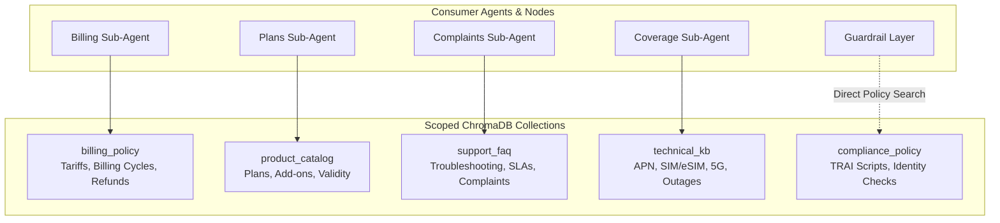
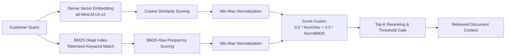

# Knowledge Retrieval & Scoped Hybrid RAG

This document is a technical study and reference guide for the domain-scoped ChromaDB collections, hybrid retrieval fusing BM25 with dense vector embeddings, and semantic document ingestion in VAY.

---

## 1. Multi-Collection Architecture

**Primary Code Reference:** [`src/vay/rag/vector_store.py`](file:///home/vishvaa/Projects/VAY-multilingual-agent/src/vay/rag/vector_store.py)

To prevent cross-domain hallucinations, VAY segments knowledge into 5 domain-scoped ChromaDB collections defined in [`KB_COLLECTIONS`](file:///home/vishvaa/Projects/VAY-multilingual-agent/src/vay/rag/vector_store.py#L35):



```python
# Code snippet from src/vay/rag/vector_store.py
KB_COLLECTIONS: dict[str, str] = {
    "billing_policy": "billing_policy",
    "product_catalog": "product_catalog",
    "support_faq": "support_faq",
    "technical_kb": "technical_kb",
    "compliance_policy": "compliance_policy",
}
```

- **Scoped Isolation**: Each sub-agent is bound strictly to its domain collection via [`build_billing_rag_tool`](file:///home/vishvaa/Projects/VAY-multilingual-agent/src/vay/rag/retriever.py), [`build_product_rag_tool`](file:///home/vishvaa/Projects/VAY-multilingual-agent/src/vay/rag/retriever.py), etc.
- **Compliance Isolation**: `compliance_policy` is never exposed as an LLM tool; it is queried exclusively by [`guardrail_node`](file:///home/vishvaa/Projects/VAY-multilingual-agent/src/vay/graph/nodes/utils.py) via [`compliance_policy_search()`](file:///home/vishvaa/Projects/VAY-multilingual-agent/src/vay/rag/retriever.py#L182).

---

## 2. Hybrid Retrieval Engine (BM25 + Dense Vectors)

**Primary Code Reference:** [`src/vay/rag/hybrid.py`](file:///home/vishvaa/Projects/VAY-multilingual-agent/src/vay/rag/hybrid.py)

Small dense embedding models (`all-MiniLM-L6-v2`) frequently lose precision on exact plan codes (e.g. `PPD_VALUE`), rupee prices (`Rs 299`), and data allowances (`2 GB/day`). VAY fuses BM25 term frequency with vector cosine similarity.



### Fusion Algorithm in Code:
```python
# Code snippet from src/vay/rag/hybrid.py
def search(self, collection_name: str, query: str, top_k: int = 4) -> list[dict[str, Any]]:
    # 1. Dense vector query via ChromaDB
    vec_results = chroma.query_collection(collection_name, query_texts=[query], n_results=top_k * 2)
    
    # 2. Sparse keyword query via BM25Okapi
    bm25_index = self._get_bm25_index(collection_name)
    tokenized_query = re.findall(r"\w+", query.lower())
    bm25_scores = bm25_index.get_scores(tokenized_query)
    
    # 3. Min-Max normalization & 50/50 fusion
    norm_vec = min_max_scale(vec_scores)
    norm_bm25 = min_max_scale(bm25_scores)
    fused_score = 0.5 * norm_vec + 0.5 * norm_bm25
    
    # 4. Sort and return top_k
    return sorted(candidates, key=lambda x: x["score"], reverse=True)[:top_k]
```

---

## 3. Semantic Document Ingestion & Chunking

**Primary Code References:** [`src/vay/rag/manager_ingest.py`](file:///home/vishvaa/Projects/VAY-multilingual-agent/src/vay/rag/manager_ingest.py), [`src/vay/rag/chunking.py`](file:///home/vishvaa/Projects/VAY-multilingual-agent/src/vay/rag/chunking.py)

Knowledge base documents (`data/kb/*.md`) are parsed and ingested using a sentence-boundary chunker:

```python
# Code snippet from src/vay/rag/chunking.py
def chunk_markdown(
    markdown_text: str,
    chunk_size: int = 500,
    chunk_overlap: int = 100,
) -> list[Chunk]:
    # 1. Tokenize into sentences using NLTK
    sentences = nltk.sent_tokenize(markdown_text)
    
    # 2. Propagate parent section headings to retain semantic context
    # 3. Generate content-addressed SHA-256 chunk IDs for idempotent upserts
```

- **Target Window**: ~500 characters with ~100 characters overlap, optimized for the 256-token context window of `all-MiniLM-L6-v2`.
- **Heading Context Propagation**: Prepend parent section headers (e.g. `## 1. Postpaid Roaming Rates`) to every subordinate chunk so isolated sentences retain complete semantic context.
- **Idempotent Ingestion**: Chunk IDs are content-addressed hashes (`sha256(text + source)`). Re-ingesting updates changed chunks without creating duplicates.

---

## 4. Confidence Tracking & Scoring

**Primary Code Reference:** [`src/vay/rag/retriever.py`](file:///home/vishvaa/Projects/VAY-multilingual-agent/src/vay/rag/retriever.py#L35-L65)

The [`RetrievalTracker`](file:///home/vishvaa/Projects/VAY-multilingual-agent/src/vay/rag/retriever.py#L35) tracks the highest relevance score encountered during a sub-agent's execution turn:

```python
# Code snippet from src/vay/rag/retriever.py
class RetrievalTracker:
    def __init__(self) -> None:
        self.best_similarity: float = 0.0

    def update(self, score: float) -> None:
        if score > self.best_similarity:
            self.best_similarity = score
```

- **Guardrail Floor**: If `best_similarity < min_similarity` (default 0.30), [`guardrail_node`](file:///home/vishvaa/Projects/VAY-multilingual-agent/src/vay/graph/nodes/utils.py#L74) rejects the draft answer and transfers the call to a human agent.

---

## 5. Knowledge Base Administration CLI

**Primary Code References:** [`scripts/build_kb.py`](file:///home/vishvaa/Projects/VAY-multilingual-agent/scripts/build_kb.py), [`scripts/manage_kb.py`](file:///home/vishvaa/Projects/VAY-multilingual-agent/scripts/manage_kb.py)

```bash
# Ingest all 5 markdown files into ChromaDB
uv run python scripts/build_kb.py

# Wipe and rebuild cleanly
uv run python scripts/build_kb.py --reset

# Inspect collections and chunk counts
uv run python scripts/manage_kb.py --list
```
