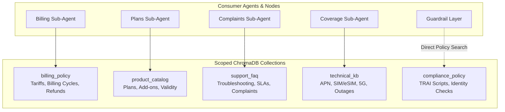
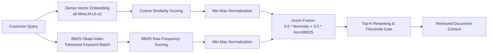

# Knowledge Retrieval & Scoped Hybrid RAG

This document describes the Retrieval-Augmented Generation (RAG) architecture, multi-collection storage, hybrid search fusing BM25 with dense vector embeddings, and semantic document ingestion in VAY.

---

## 1. Multi-Collection Knowledge Base Architecture

To prevent cross-domain hallucination and ensure high-precision retrieval, VAY segments knowledge into 5 domain-scoped ChromaDB collections (`src/vay/rag/vector_store.py`).



### Collection Isolation Rules:
- Sub-agents are only provided access to their respective domain collection.
- `compliance_policy` is never exposed as an LLM tool; it is queried directly by the guardrail verification layer via `compliance_policy_search()`.

---

## 2. Hybrid Retrieval Engine (`src/vay/rag/hybrid.py`)

Pure dense vector search with small embedding models (`all-MiniLM-L6-v2`) frequently struggles with precise alphanumeric tokens (e.g., plan codes like `PPD_VALUE`, rupee amounts like `Rs 299`, or data limits like `1.5 GB/day`). VAY solves this with an integrated **Hybrid BM25 + Vector Fusion Engine**.



### Fusion Algorithm:
1. **Dense Vector Search**: ChromaDB computes cosine distances and converts them to similarity scores ($S_{\text{dense}} = 1 - \text{distance}$).
2. **BM25 Keyword Search**: `rank_bm25.BM25Okapi` evaluates term frequency across document chunks in the target collection.
3. **Score Normalization**: Both dense and sparse score distributions are normalized to $[0, 1]$ via min-max scaling.
4. **Fused Score**:
   $$\text{Score}_{\text{hybrid}} = 0.5 \cdot \text{Score}_{\text{dense, norm}} + 0.5 \cdot \text{Score}_{\text{bm25, norm}}$$
5. **Reranking**: Results are sorted descending by the fused score, returning the top $k$ chunks (default $k=4$).

---

## 3. Semantic Document Ingestion Pipeline

Knowledge base documents are stored as structured markdown files in `data/kb/` and processed using `src/vay/rag/manager_ingest.py`.

### 3.1 Sentence-Boundary Chunking (`src/vay/rag/chunking.py`)
- **Token Window Alignment**: Target chunk size is ~500 characters with ~100 characters overlap, optimized for the 256-token context window of `all-MiniLM-L6-v2`.
- **Heading Context Propagation**: Parent section headers (`## 1. Postpaid Roaming Rates`) are prepended to every subordinate chunk. This ensures that standalone sentences retain full semantic context during vector search.
- **Content-Addressed Hashing**: Each chunk is assigned a deterministic SHA-256 ID based on its text and source. Ingestion is fully idempotent: re-running `build_kb.py` updates modified chunks without duplicating existing records.

### 3.2 Categorization (`src/vay/rag/categorizer.py`)
- **Guided Categorization**: Domain-specific category tags (e.g., `["tariff", "late_fee", "roaming"]`) are attached during ingestion for filtered retrieval.
- **Unsupervised Fallback**: Unlabeled text uses KMeans clustering over TF-IDF vectors to generate automatic topic labels.

---

## 4. Confidence Thresholding & Safety Escalation

Every retrieval turn evaluates the highest similarity score obtained:

```python
class RetrievalTracker:
    def __init__(self):
        self.best_similarity: float = 0.0

    def update(self, score: float):
        if score > self.best_similarity:
            self.best_similarity = score
```

- **Guardrail Gate**: If `retrieval_score < DEFAULT_MIN_SIMILARITY` (configured at 0.30 in runtime, with an unresolved safety threshold recommendation of 0.75 in compliance audit documents), the system rejects the draft answer and safely transfers the caller to a human agent.

---

## 5. Knowledge Base Management Commands

Build or reset knowledge base collections using the CLI:

```bash
# Ingest all markdown files in data/kb/ into ChromaDB
uv run python scripts/build_kb.py

# Wipe all collections and rebuild cleanly
uv run python scripts/build_kb.py --reset

# Manage individual collections
uv run python scripts/manage_kb.py --list
uv run python scripts/manage_kb.py --collection product_catalog --rebuild
```
