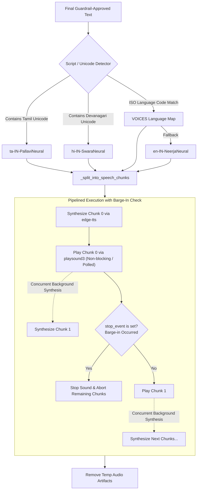

# Text-to-Speech (TTS) Pipeline

This document is a technical study and reference guide for the Text-to-Speech (TTS) engine, script-aware neural voice routing, sentence-level pipelined synthesis, and interruptible playback architecture (Barge-In) in VAY.

---

## 1. Subsystem Architecture

**Primary Code Reference:** [`src/vay/tts/engine.py`](file:///home/vishvaa/Projects/VAY-multilingual-agent/src/vay/tts/engine.py)

VAY leverages Microsoft Edge Neural Voices via `edge-tts` to deliver high-quality, natural voice synthesis across 18 languages without GPU memory overhead:



---

## 2. Neural Voice Matrix & Language Support

**Primary Code Reference:** [`VOICES` in `src/vay/tts/engine.py`](file:///home/vishvaa/Projects/VAY-multilingual-agent/src/vay/tts/engine.py#L35-L56)

```python
# Code snippet from src/vay/tts/engine.py
VOICES: dict[str, str] = {
    "ta": "ta-IN-PallaviNeural",
    "hi": "hi-IN-SwaraNeural",
    "en": "en-IN-NeerjaNeural",
    "te": "te-IN-ShrutiNeural",
    "kn": "kn-IN-SapnaNeural",
    "ml": "ml-IN-SobhanaNeural",
    "mr": "mr-IN-AarohiNeural",
    "gu": "gu-IN-DhwaniNeural",
    "ur": "ur-IN-GulNeural",
    "fr": "fr-FR-DeniseNeural",
    "de": "de-DE-KatjaNeural",
    "es": "es-ES-ElviraNeural",
    "ja": "ja-JP-NanamiNeural",
    "ko": "ko-KR-SunHiNeural",
    "zh": "zh-CN-XiaoxiaoNeural",
    "ar": "ar-AE-FatimaNeural",
    "it": "it-IT-ElsaNeural",
    "ru": "ru-RU-SvetlanaNeural",
}
FALLBACK_VOICE = VOICES["en"] # en-IN-NeerjaNeural
```

---

## 3. Script-Aware Voice Selection

**Primary Code Reference:** [`src/vay/tts/engine.py`](file:///home/vishvaa/Projects/VAY-multilingual-agent/src/vay/tts/engine.py#L260-L290)

When multilingual models generate code-switched or translated text, the language metadata might state `en` while the content contains native Indic Unicode script (e.g. `உங்கள் plan active`).

```python
# Code snippet from src/vay/tts/engine.py
def _detect_script(text: str) -> str | None:
    for ch in text:
        cp = ord(ch)
        if 0x0B80 <= cp <= 0x0BFF:  # Tamil Unicode Block
            return "ta"
        if 0x0900 <= cp <= 0x097F:  # Devanagari Block (Hindi/Marathi)
            return "hi"
    return None
```

- If Tamil or Devanagari characters are detected in a reply tagged as English, the engine automatically switches to `ta-IN-PallaviNeural` or `hi-IN-SwaraNeural`. This prevents the English TTS engine from spelling out Indic Unicode codepoints as numeric sequences.

---

## 4. Sentence-Level Streaming Pipelining

**Primary Code Reference:** [`src/vay/tts/engine.py`](file:///home/vishvaa/Projects/VAY-multilingual-agent/src/vay/tts/engine.py#L86-L211)

### 4.1 Speech Chunking (`_split_into_speech_chunks`)
Splits text across Latin (`.`, `!`, `?`), Devanagari danda (`।`, `॥`), CJK punctuation (`。`, `！`, `？`), and Arabic punctuation (`؟`, `۔`).

### 4.2 Pipelined Synthesis (`_speak_pipelined`)
```python
# Code snippet from src/vay/tts/engine.py
async def _speak_pipelined(chunks: list[str], voice: str, stop_event: threading.Event | None = None) -> None:
    loop = asyncio.get_running_loop()
    next_chunk_task = asyncio.ensure_future(_synthesize_chunk(chunks[0], voice))
    
    for i in range(len(chunks)):
        if stop_event and stop_event.is_set():
            break
        current_path = await next_chunk_task
        
        # Pre-synthesize next chunk in background while playing current chunk
        if i + 1 < len(chunks):
            next_chunk_task = asyncio.ensure_future(_synthesize_chunk(chunks[i + 1], voice))
            
        await loop.run_in_executor(None, _play_file, current_path, stop_event)
```

- **Latency Gain**: Time-to-first-audio drops from **~1.85s** to **~1.08s** (~40% faster) because playback starts as soon as Sentence 0 is ready.

---

## 5. Non-Blocking Interruptible Playback (Barge-In)

**Primary Code Reference:** [`_play_file` in `src/vay/tts/engine.py`](file:///home/vishvaa/Projects/VAY-multilingual-agent/src/vay/tts/engine.py#L121-L148)

```python
# Code snippet from src/vay/tts/engine.py
def _play_file(path: str, stop_event: threading.Event | None = None) -> None:
    if stop_event is None:
        playsound(path)
    else:
        sound = playsound(path, block=False)
        while sound.is_alive():
            if stop_event.is_set():
                sound.stop() # Instant process termination
                break
            time.sleep(0.05) # 50ms polling loop
```

- If the caller begins speaking, `STTPipeline` fires `on_barge_in()`, which sets `stop_event`.
- The polling loop stops `playsound3` within 50 ms and deletes temporary audio files.
