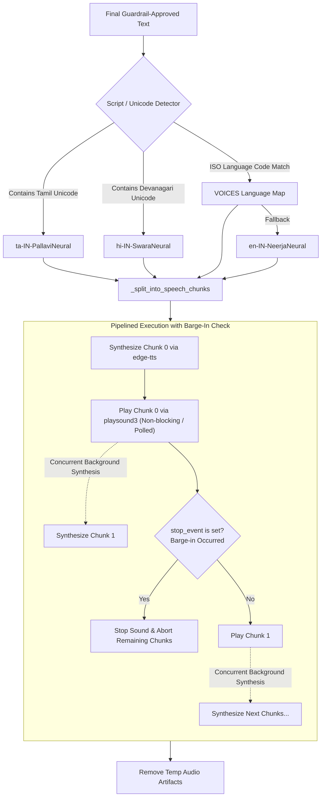

# Text-to-Speech (TTS) Pipeline

This document details the Text-to-Speech (TTS) engine, script-aware neural voice routing, sentence-level pipelined synthesis, and interruptible playback architecture (Barge-In) implemented in VAY.

---

## 1. TTS Subsystem Overview

VAY uses Microsoft Edge Neural Voices via `edge-tts` (`src/vay/tts/engine.py`) to deliver natural, human-like voice synthesis across 18 languages without requiring local GPU VRAM.

---

## 2. Supported Languages & Neural Voice Mapping

| Language | ISO Code | Voice Identifier | Gender | Locale |
|---|---|---|---|---|
| **Tamil** | `ta` | `ta-IN-PallaviNeural` | Female | India |
| **Hindi** | `hi` | `hi-IN-SwaraNeural` | Female | India |
| **English (Indian)** | `en` / `en-IN` | `en-IN-NeerjaNeural` | Female | India |
| **Telugu** | `te` | `te-IN-ShrutiNeural` | Female | India |
| **Kannada** | `kn` | `kn-IN-SapnaNeural` | Female | India |
| **Malayalam** | `ml` | `ml-IN-SobhanaNeural` | Female | India |
| **Marathi** | `mr` | `mr-IN-AarohiNeural` | Female | India |
| **Gujarati** | `gu` | `gu-IN-DhwaniNeural` | Female | India |
| **Bengali** | `bn` | `bn-IN-TanishaaNeural` | Female | India |
| **Urdu** | `ur` | `ur-IN-GulNeural` | Female | India |
| **French** | `fr` | `fr-FR-DeniseNeural` | Female | France |
| **German** | `de` | `de-DE-KatjaNeural` | Female | Germany |
| **Spanish** | `es` | `es-ES-ElviraNeural` | Female | Spain |
| **Japanese** | `ja` | `ja-JP-NanamiNeural` | Female | Japan |
| **Korean** | `ko` | `ko-KR-SunHiNeural` | Female | Korea |
| **Chinese (Mandarin)**| `zh` | `zh-CN-XiaoxiaoNeural`| Female | China |
| **Arabic** | `ar` | `ar-SA-ZariyahNeural` | Female | Saudi Arabia |
| **Russian** | `ru` | `ru-RU-SvetlanaNeural` | Female | Russia |

---

## 3. Script-Aware Voice Selection

When multilingual models generate code-switched text, the detected turn language code might say `en` while the text content contains Tamil script (e.g. `உங்கள் plan active`).
- **Unicode Range Detection**: `_detect_script(text)` inspects Unicode codepoint blocks (Tamil: `\u0B80-\u0BFF`, Devanagari: `\u0900-\u097F`).
- **Voice Realignment**: If Indic script is detected in text labeled as English, the voice selector automatically routes to the native neural voice (`ta-IN-PallaviNeural` or `hi-IN-SwaraNeural`). This prevents the English TTS engine from attempting to read Indic Unicode codepoints phonetically as numeric sequences.

---

## 4. Latency Optimization: Sentence-Level Pipelining

In standard implementations, speech synthesis blocks until the entire multi-sentence paragraph is downloaded and written to disk, creating noticeable caller latency (1.8s - 2.5s).

### Optimized Pipelining Implementation:
1. **Sentence Boundary Splitting (`_split_into_speech_chunks`)**:
   - Splits text using regex on sentence delimiters across all supported alphabets: Latin (`.`, `!`, `?`), Devanagari danda (`।`, `॥`), and CJK fullwidth punctuation (`。`, `！`, `？`).
   - Small responses (< 120 characters) remain intact to avoid unnecessary network roundtrips.
2. **Asynchronous Pre-buffering (`_speak_pipelined`)**:
   - Synthesizes Chunk 0 and starts playing it immediately using `playsound3`.
   - While Chunk 0 is actively playing, a background thread concurrently synthesizes Chunk 1.
   - When Chunk 0 playback finishes, Chunk 1 audio is already in memory or on disk, ready for immediate playback.
3. **Latency Impact**:
   - Time-to-first-audio reduced from **~1.85s** to **~1.08s** (~40% reduction for a 3-sentence reply), scaling even higher on longer responses.

---

## 5. Non-Blocking Interruptible Playback (Barge-In)

To support natural conversation flow where the user speaks before the assistant finishes:
- **`stop_event: threading.Event`**: Passed into `tts.speak()` by the call loop (`scripts/run_voice.py`).
- **Non-Blocking Sound Polling (`_play_file`)**: Audio is started asynchronously (`block=False`). A lightweight polling loop (`_BARGE_IN_POLL_S = 0.05s`) monitors `sound.is_alive()` and checks `stop_event.is_set()`.
- **Immediate Termination**: If `stop_event` is set, `sound.stop()` terminates the audio subprocess immediately, cancels any upcoming synthesis tasks, and safely cleans up temporary MP3 files.
